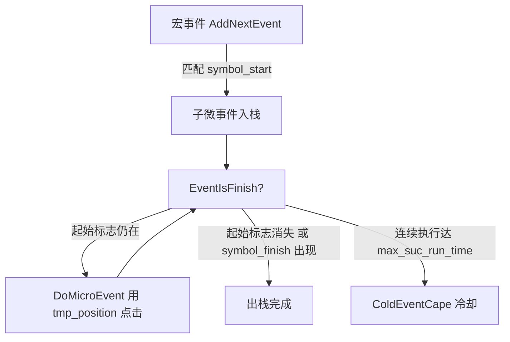
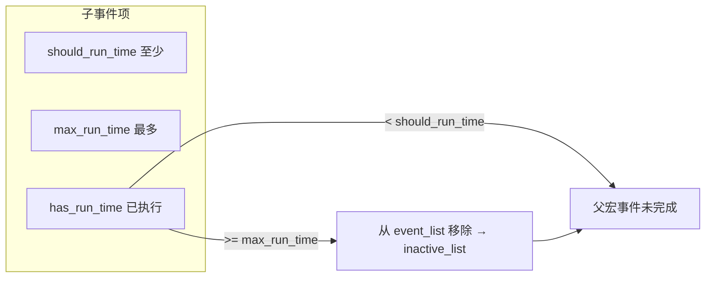
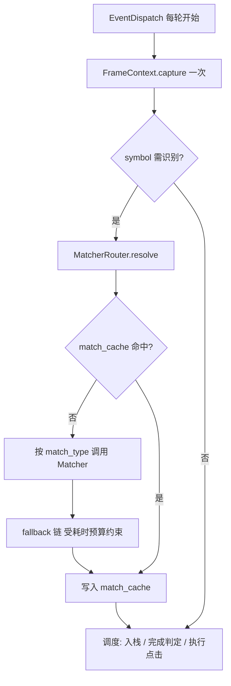
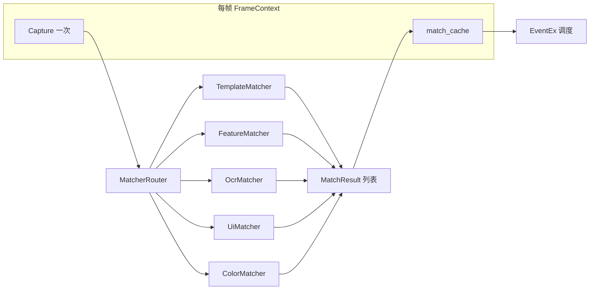
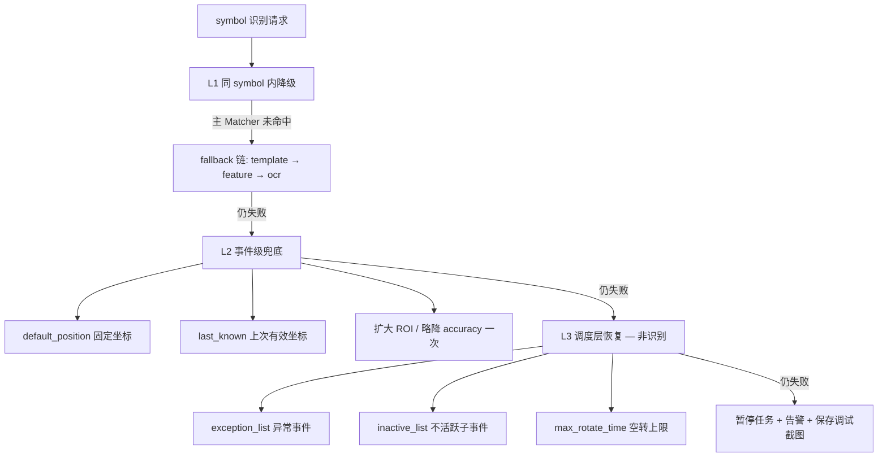
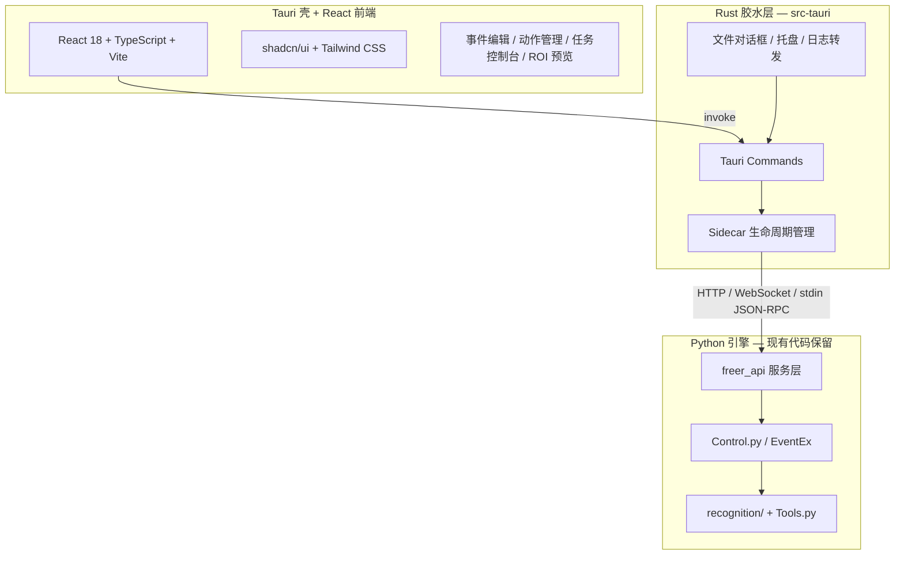

# Freer 升级计划

> 基于 V0.1 代码审阅的逻辑问题分析与分阶段改进路线图。  
> 审阅范围：`Control.py`、`Models.py`、`Tools.py`、`View/*`、`main.py`

---

## 一、总体评估

Freer 的核心设计（**事件树 + 图像触发 + 栈式调度 + 异常/冷却机制**）思路清晰，适合模拟器脚本类场景。但当前实现处于**原型阶段**：多处存在确定性逻辑缺陷、状态管理隐患和工程化缺失，在复杂任务或长时间运行下容易出现**误点击、死循环、状态串扰**等问题。

建议按 **「修 Bug → 稳架构 → 识别路由 → 补工程（含 freer_api）→ GUI 产品化（路线 B）」** 五阶段推进，优先修复会影响正确性的逻辑问题，再落地多 Matcher 识别模块，Phase 2 建立 Python API 边界，Phase 3 以 Tauri + React 交付新界面（见 **§4.6**）。

---

## 二、逻辑问题清单

### 2.1 严重（P0）— 会直接导致错误行为

| # | 位置 | 问题 | 影响 |
|---|------|------|------|
| P0-1 | `ActionEx.Drag` L31–58 | `i += 2` 写在 `for j in range(action.run_time)` **内部** | `run_time > 1` 时索引跳跃错误，可能 **IndexError** 或跳过拖拽点对；同一对坐标被重复拖拽 |
| P0-2 | `EventEx` L98–109 | `stack`、`event_tree_template`、`run_time` 等定义为 **类变量** | 多任务/多实例时 **共享同一栈与状态**，后启动的任务污染先启动的任务 |
| P0-3 | `Models.GrandEvent` / `MicroEvent` / `Action` | `event_list`、`has_rotate_time`、`action`、`hwnd` 等作为 **类属性** | 实例间可能共享可变状态；`SetByDict` 行为不一致 |
| P0-4 | `CountAndClearRedundant` + `EventIsFinish` | 子事件 `has_run_time >= max_run_time` 时从 `event_list` **移除**，但父宏事件完成条件仍要求剩余子事件 `has_run_time >= should_run_time` | 当 `max_run_time < should_run_time` 或子事件提前被移除时，父事件可能 **在未满足最少执行次数的情况下完成** |
| P0-5 | `AddNextEvent` L241–247 | 多个子事件 **共用相同 `symbol_start`** 时，按列表顺序取第一个匹配 | 无法区分应执行哪个分支（`main.py` 已注释此问题） |
| P0-6 | `ImageTool.FindImage` L80 | `cv2.imread('sc.bmp')` 失败时返回 `None`，未校验 | **AttributeError** 导致任务崩溃 |
| P0-7 | `ActionEx.Drag` L42–50 | 起点终点相同或 `abs(y1-y2)==0` / `abs(x1-x2)==0` 时除零 | 拖拽动作异常中断 |

### 2.2 中等（P1）— 边界场景或长期运行风险

| # | 位置 | 问题 | 影响 |
|---|------|------|------|
| P1-1 | `DoMicroEvent` L305 | 执行时使用 `tmp_position`（入栈时缓存），非实时重识别 | 界面动画/滚动后点击 **偏移或点到错误区域** |
| P1-2 | `EventIsFinish` 微事件无 `symbol_finish` | 以「起始标志消失」作为完成条件 | 识别抖动时可能在「未完成 / 已完成」间 **反复横跳** |
| P1-3 | `AddNextEvent` L244–245 | 同一帧内对同一目标 **调用两次** `GetPosition` | 性能浪费；极端情况下两次结果不一致 |
| P1-4 | `ActionEx.LeftClick` L14 | `position[i][0] = 0` **原地修改**序号字段 | 若 position 被复用，后续逻辑坐标序号错乱 |
| P1-5 | `ColdEventCape` L361 | 冷却回退时 `run_time -= 1` | 无下界保护，可能出现 **负数计数**，冷却逻辑失效 |
| P1-6 | `RecoverExceptionEvent` L375 | 仅 `is_exception and event_type==0`（异常宏事件）触发恢复 | **异常微事件** 执行后不会恢复 `inactive_list` |
| P1-7 | `GetWindowHwnd` | 窗口未找到时仅 print，仍继续执行 | 向 **hwnd=0/None** 发消息，行为不可预期 |
| P1-8 | `Tools.ImageTool.Capture` | `os.system('adb ...')` 无返回值检查 | ADB 断连时静默失败，后续识别全部失效 |
| P1-9 | `ActionTool.InputCharacter` | `os.system('adb shell input text ' + c)` | 特殊字符注入失败；**shell 注入**风险 |
| P1-10 | 路径硬编码 | `EventEx` 用 `./data/`，`DataManager` 用 `../data/` | 工作目录不同则 **读写不同文件** 或找不到文件 |

### 2.3 较轻（P2）— 设计/可维护性问题

| # | 位置 | 问题 |
|---|------|------|
| P2-1 | `ImageTool.FindImage` | `hwnd` 参数未使用；每模板只取 `minMaxLoc` 单个匹配点 |
| P2-2 | `ImageTool.FindImage` L80 | 对 BGR 图使用 `COLOR_RGBA2RGB`，颜色空间处理不当 |
| P2-3 | `GrandEvent.symbol_start` L165 | 拼接子事件标志，调度逻辑中 **未实际使用** |
| P2-4 | `type(x).__name__ == 'dict'` | 脆弱的类型判断，应使用 `isinstance` |
| P2-5 | `DataManager.AddObj` | `obj.__dict__` 序列化，易混入运行时字段（`hwnd`、`has_rotate_time` 等） |
| P2-6 | `FileTool.WriteJSON` | 无缩进、`ensure_ascii=True` 默认，中文可读性差 |
| P2-7 | GUI | `AddEvent.py` / `EditEvent.py` 大量重复代码；无动作管理界面；Phase 3 将用 **§4.6 路线 B** 统一为 Tauri/React SPA |
| P2-8 | 动作类型 | 注释提到 `action_type=2` 右键，**未实现** |
| P2-9 | 日志 | 仅 `print`，无级别、无文件、无法回溯 |

---

## 三、架构与流程问题（图示）

### 3.1 微事件生命周期（当前）



**问题**：`tmp_position` 在入栈时写入，执行阶段不刷新；完成判定与执行使用不同帧的识别结果，易产生竞态。

### 3.2 子事件计数与移除（当前）



**问题**：被移除的子事件不再参与父事件完成检查，「至少 N 次」约束可能被绕过。

### 3.3 识别流程（目标）



**相对现状的改进**：单帧单截屏、显式 Matcher 路由、执行前从当前帧取坐标，避免 `tmp_position` 过期与重复识别。

---

## 四、可优化与增强方向

### 4.1 正确性

- 统一 **单次截屏 → 单次识别 → 结果缓存** 供本帧内所有判断与动作使用
- 子事件匹配引入 **优先级 / 互斥组 / 多模板联合条件**（AND/OR）
- 明确 `should_run_time` 与 `max_run_time` 语义：移除前必须校验 `has_run_time >= should_run_time`
- 拖拽、点击动作增加 **边界与除零保护**

### 4.2 性能

- ADB 截屏改为 `subprocess` + 管道读 bytes，避免写盘 `sc.bmp`
- 模板预加载与缓存；**所有 Matcher 强制 ROI**，禁止默认全屏扫描
- 帧内 `match_cache` 避免同一 symbol 重复识别；OCR 支持降频
- 单帧识别耗时预算（§4.5.6）：单 symbol ≤ 80 ms，整帧 ≤ 200 ms
- 减少 `EventDispatch` 每轮重复 IO（窗口句柄缓存、配置热加载开关）

### 4.3 工程化

- 引入 `config.yaml`：ADB 设备 ID、数据目录、默认精度、日志路径
- 路径基于 **项目根目录** 解析，消除 `./` vs `../` 分歧
- `requirements.txt` + 最低 Python 版本说明
- 结构化日志（`logging`）与可选 GUI 日志面板
- 单元测试覆盖：`GetRandomPosition`、事件树构建、完成判定、Drag 索引逻辑

### 4.4 功能扩展

| 能力 | 说明 |
|------|------|
| 动作管理 GUI | 增删改 `action.json`；Phase 3 在 Tauri/React 中实现（§4.6） |
| 任务运行 GUI | 选择根事件、重复次数、开始/停止/暂停；WebSocket 日志（§4.6.4） |
| 右键点击 / 长按 | 补全 `action_type=2` 等 |
| 多 Matcher 识别 | 见 **§4.5**，按场景路由 template / feature / ocr / ui / color |
| 录制回放 | 截屏选点 → 自动生成微事件 |
| 跨平台 | macOS/Linux 通过纯 ADB 输入输出，弱化 Win32 依赖 |

### 4.5 识别方案升级（多 Matcher 路由）

> **目标**：在不依赖 Airtest 的前提下，集成多种识别方案，按场景显式路由；控制单帧开销，避免 YOLO / CLIP 等重型方案进入默认路径。

#### 4.5.1 设计原则

| 原则 | 说明 |
|------|------|
| **显式路由** | 每个 `symbol_start` / `symbol_finish` 在配置中声明 `match_type`，引擎 dispatch，不做运行时「智能猜类型」 |
| **帧内一次截屏** | `EventDispatch` 每轮构建 `FrameContext`，本帧内所有判定与动作共用同一份截图与 `match_cache` |
| **重模块懒加载** | OCR 模型、ORB detector 首次使用时初始化并单例复用；未启用的 Matcher 不占内存 |
| **ROI 优先** | 除 UI 树查询外，template / feature / ocr / color 均应在 ROI 内执行，禁止默认全屏扫描 |
| **可选 fallback 链** | 仅允许「从轻到重」顺序（如 `template → feature → ocr`），且受单帧耗时预算约束 |
| **不引入 Airtest** | 自研 `recognition/` 模块，保持与 Freer 事件树调度解耦 |

#### 4.5.2 目标架构



**目录结构（建议）**：

```
freer/
├── recognition/
│   ├── types.py          # SymbolSpec, Rect, FrameContext
│   ├── router.py         # MatcherRouter
│   ├── frame.py          # 截屏 + 坐标系
│   ├── parse.py          # 兼容旧版字符串 symbol_start
│   └── matchers/
│       ├── template.py   # 多实例 + ROI + NMS
│       ├── feature.py    # ORB（小模板 + ROI）
│       ├── ocr.py        # PaddleOCR（ROI，懒加载）
│       ├── ui.py         # uiautomator2（text / resourceId）
│       └── color.py      # 色块 / 红点检测
├── Control.py            # GetPosition / EventDispatch 接入 Router
└── Tools.py              # Capture 迁入 AdbClient / frame.py
```

#### 4.5.3 Matcher 分级与场景路由

| match_type | 典型耗时 | 适用场景 | 备注 |
|------------|----------|----------|------|
| **color** | < 1 ms | 固定色块、红点、状态条 | 最轻量，优先于 template |
| **template** | 5–20 ms | 固定 icon、UI 基本不变 | 默认首选；须配合 ROI + 多实例 NMS |
| **feature** | 10–30 ms | 轻微缩放 / 动效帧 | ORB；仅小模板 + ROI |
| **ui** | 10–50 ms | 系统弹窗、原生 Android 控件 | uiautomator2；与 ADB 坐标体系一致 |
| **ocr** | 30–150 ms | 文字按钮、动态数值 | PaddleOCR；**必须 ROI**；可每 N 帧降频 |

**路由经验规则**（写入 README / 配置说明）：

- 能 **ui** 就不 **ocr**
- 能 **ROI** 就不全屏
- 能 **template** 就不 **feature**
- 能 **color** 就不 **template**

**默认不纳入方案**（开销过大或需 GPU）：

- CLIP / 多模态语义匹配
- 全屏 YOLO 每帧检测
- 全图 SIFT 扫描
- 全屏 OCR

以上可作为 Phase 4+ 可选插件，**默认关闭**。

#### 4.5.4 统一数据结构与接口

```python
@dataclass
class Rect:
    index: int       # 多目标序号
    x1, y1, x2, y2: int
    score: float
    source: str      # template | feature | ocr | ui | color

@dataclass
class SymbolSpec:
    type: str                    # template | feature | ocr | ui | color
    target: str                  # 图片路径 | 文字 | resource-id | #RRGGBB
    accuracy: float = 0.85
    roi: list | None = None      # [x1, y1, x2, y2] 设备坐标
    index: int = 0               # 同屏多实例取第几个
    fallback: list | None = None # 如 ["feature", "ocr"]

class BaseMatcher:
    def match(self, frame: FrameContext, spec: SymbolSpec) -> list[Rect]: ...
```

`EventEx.GetPosition()` 改为解析 `SymbolSpec` 并调用 `MatcherRouter.resolve()`；返回值保持 `[index, x1, y1, x2, y2]` 以兼容现有调度逻辑。

#### 4.5.5 配置格式（向后兼容）

**旧格式**（继续支持）：

```json
"symbol_start": "../img/btn.bmp|../img/btn2.bmp"
```

解析为 `match_type: template`，`|` 分隔多模板。

**新格式（对象）**：

```json
"symbol_start": {
  "type": "ocr",
  "target": "讨伐",
  "accuracy": 0.9,
  "roi": [200, 800, 880, 1200],
  "index": 0,
  "fallback": ["template"]
}
```

**新格式（扁平字段，便于 GUI）**：

```json
"match_type_start": "ocr",
"symbol_start": "讨伐",
"roi_start": [200, 800, 880, 1200],
"match_fallback_start": "template|../img/讨伐.bmp"
```

`symbol_finish`、宏事件子事件触发条件共用同一套 `SymbolSpec` 解析。

#### 4.5.6 性能预算

```python
MAX_MATCH_MS_PER_SYMBOL = 80    # 单个 symbol（含 fallback 链）上限
MAX_MATCH_MS_PER_FRAME = 200    # 整帧所有识别总和上限
```

fallback 链累计超时则本帧该 symbol 判定为未命中，下帧重试；避免单帧 template → feature → ocr 拖死主循环。

OCR 可选策略：上帧 ROI 内高置信命中则本帧 skip；或每 2–3 帧全量 OCR 一次。

#### 4.5.7 与调度层的衔接

| 调度点 | 改动 |
|--------|------|
| `EventDispatch` | 每轮开头 `self.frame = FrameContext.capture()`，初始化 `match_cache` |
| `EventIsFinish` | 读 `match_cache`，完成判定加 **连续 N 帧防抖** |
| `AddNextEvent` | 合并重复 `GetPosition` 调用；同标志子事件结合 `priority` + `index` |
| `DoMicroEvent` | **执行前从当前帧 Router 取坐标**，废弃入栈时 `tmp_position` 缓存 |

#### 4.5.8 依赖（按需安装）

| 依赖 | 用途 | 安装策略 |
|------|------|----------|
| `opencv-python` | template / feature | 已有 |
| `paddleocr` | ocr Matcher | 可选依赖，懒加载 |
| `uiautomator2` | ui Matcher | 可选依赖，仅 `match_type=ui` 时需要 |

不引入 Airtest、不默认引入 PyTorch / YOLO。

#### 4.5.9 与现有问题清单的对应

| 原问题 | 识别方案如何解决 |
|--------|------------------|
| P2-1 单点 minMaxLoc | TemplateMatcher 多实例 + NMS + `index` 选择 |
| P0-5 同标志子事件冲突 | `priority` + 多实例 `index` + 不同 match_type |
| P1-1 tmp_position 过期 | 帧内缓存 + DoMicroEvent 执行前重新 resolve |
| P1-3 重复 GetPosition | FrameContext.match_cache |
| P2-2 颜色空间错误 | frame.py 统一 BGR，按通道处理 |
| 坐标系不一致 | ui / 纯 ADB 输入统一设备坐标；逐步弱化 Win32 PostMessage |

#### 4.5.10 兜底识别策略

> **结论：要考虑，但必须分层。**  
> 「兜底」不等于「失败后自动试遍所有 Matcher」——那样会击穿 §4.5.6 性能预算，并提高误触概率。  
> 正确做法是：**识别层兜底**（单 symbol 内）与 **调度层恢复**（宏事件级）分工，二者不要混为一谈。

##### 三层兜底模型



| 层级 | 职责 | 触发条件 | 开销 |
|------|------|----------|------|
| **L1** symbol 内 fallback | 换一种 Matcher 再试 | 主 `match_type` 未命中 | 中（受 80 ms 预算约束） |
| **L2** 事件级兜底 | 不依赖当前帧图像的坐标回退 | L1 全链失败 | 极低 |
| **L3** 调度层恢复 | 换事件路径或中止任务 | 无法入栈 / 长期空转 | 无额外识别 |

Freer **已有** L3 机制（`exception_list`、`inactive_list`、`max_rotate_time`），升级重点是补全 L1/L2，并与 L3 明确衔接。

##### L1：symbol 内 fallback（已有，需规范）

- 仅允许配置声明的 `fallback` 列表，**禁止** Router 自动遍历全部 Matcher。
- fallback 顺序固定为从轻到重；累计超时则本帧判定未命中，**下帧重试**，不在同一帧无限降级。
- 可选：fallback 步骤允许 **accuracy 略降一次**（如 `-0.05`），须记录日志；不允许无限降阈值。

```python
@dataclass
class SymbolSpec:
    ...
    fallback: list | None = None
    fallback_accuracy_delta: float = 0.05   # 每步降级允许降低的阈值，仅 fallback 链内生效
    max_fallback_steps: int = 2             # 除主 Matcher 外最多再试几步
```

##### L2：事件级兜底（建议新增）

当 L1 全链失败后，在 **微事件 / 子事件** 上按配置选择：

| `last_resort` 值 | 行为 | 适用 |
|------------------|------|------|
| `none`（默认） | 本帧未命中，交给调度层空转 / 异常 | 大多数事件 |
| `default_position` | 使用事件配置的固定坐标执行 | 按钮位置固定、识别偶发失败 |
| `last_known` | 使用最近一次成功识别的坐标（带 TTL） | 界面微动、识别抖动 |
| `expand_roi` | ROI 各边扩展固定像素后再试 **一次**（仍走主 Matcher） | 动画导致目标偏出 ROI |
| `pause` | 立即暂停任务并告警 | 关键步骤，禁止盲点 |

```json
{
  "symbol_start": { "type": "template", "target": "../img/btn.bmp", "roi": [100, 200, 300, 400] },
  "last_resort_start": "default_position",
  "default_position": [150, 250, 200, 300]
}
```

**`last_known` 约束**（避免点到过期位置）：

- 仅复用 **同一 symbol、同一 match_type** 的上次结果；
- TTL 默认 3 帧或 2 秒（可配置）；
- 完成出栈后清除，防止下一事件误用。

##### L3：调度层恢复（沿用并强化）

识别全失败 **不直接崩溃**，按现有顺序：

1. 扫描 `exception_list`（弹窗、网络错误等）
2. 扫描 `inactive_list`
3. `has_rotate_time += 1`，未超 `max_rotate_time` 则下帧再试
4. 超限或连续 N 帧全局未命中 → **暂停任务** + 结构化日志 + 保存当前截图到 `logs/debug/`

建议在 `config.yaml` 增加任务级阈值：

```yaml
recognition:
  max_consecutive_miss_frames: 30    # 连续无命中帧数，触发暂停
  on_task_pause: save_screenshot     # 保存调试截图
  last_known_ttl_frames: 3
```

##### 不建议作为兜底的做法

| 做法 | 原因 |
|------|------|
| 失败后自动尝试全部 Matcher | 开销不可控，违背显式路由 |
| 无 TTL 复用旧坐标 | 界面切换后误点 |
| 无限降低 accuracy | 误触率陡增 |
| 兜底链中默认启用 OCR | OCR 慢，应用户显式配置 |
| 识别失败仍强制点击 (0,0) | 危险；必须 `pause` 或跳过 |

##### 与 `DoMicroEvent` 的调用顺序

```python
def resolve_for_action(self, spec, event):
    rects = router.resolve(frame, spec)           # L1
    if not rects and spec.last_resort == "expand_roi":
        rects = router.resolve(frame, spec.with_expanded_roi())  # L2 一次
    if not rects and spec.last_resort == "last_known":
        rects = last_known_cache.get(spec.key, ttl=...)
    if not rects and spec.last_resort == "default_position":
        rects = event.default_position_as_rects()
    if not rects and spec.last_resort == "pause":
        raise TaskPausedError(...)
    return rects  # 空则调度层走 L3，不执行点击
```

##### 实施阶段

| 阶段 | 兜底相关交付 |
|------|--------------|
| Phase 1 | L1 fallback 链 + 性能预算；`last_resort: none` 默认 |
| Phase 1.5 | L2：`default_position` / `expand_roi` / `last_known` + TTL 缓存 |
| Phase 2 | L3：`max_consecutive_miss_frames`、调试截图、暂停任务 |
| Phase 3 | GUI 配置 `last_resort`、fallback 链可视化 |

### 4.6 GUI 升级方案（路线 B：Python 引擎 + Tauri/React 界面）

> **选定策略**：GUI 产品化采用 **路线 B**——保留现有 Python 引擎（`Control.py` / `Tools.py` / `recognition/`），界面层用 **Tauri 2 + React** 重写；Rust 仅承担 Tauri 要求的原生壳与 IPC 胶水，**不重写调度与识别逻辑**。  
> 视觉参考 [CC Switch](https://github.com/farion1231/cc-switch)（Tauri 2 + React + shadcn/ui）；Freer 与之差异在于业务后端仍为 Python sidecar，而非 Rust 全栈（路线 C）。

#### 4.6.1 方案对比（为何选 B）

| 路线 | 界面 | 引擎 | Rust 工作量 | 适用 |
|------|------|------|-------------|------|
| **A** PySide6 渐进美化 | Qt Widgets | Python | 无 | 改动最小，视觉上限低于现代 Web UI |
| **B** Python + Tauri/React | React + shadcn/ui | **Python 保留** | 薄（IPC、进程、文件） | **Freer 当前选定**；引擎不动，换脸 + 产品化 |
| **C** Tauri 全栈 | React + shadcn/ui | **Rust 重写** | 厚（调度、识别、Win32） | 长期产品、小包体；工作量数倍于 B |

**路线 B 为何涉及 Rust**：并非引擎需要 Rust，而是 **Tauri 框架本身**要求一层 Rust 运行时（窗口、WebView、sidecar、系统 API）。B 中 Rust 不写业务，只写「启动 Python、转发命令、读文件、系统托盘」等胶水代码。若完全不想碰 Rust，可改用 Electron 或 pywebview，但会失去 Tauri 的小体积与原生集成优势。

#### 4.6.2 目标架构



**职责划分**：

| 层 | 技术 | 职责 |
|----|------|------|
| **前端** | React 18、TypeScript、Vite、Tailwind CSS 3.4、shadcn/ui、TanStack Query、react-hook-form、zod | 表单、事件树、模板预览、ROI 选框、任务控制台、日志流 |
| **胶水** | Tauri 2、Rust（serde、tokio、tauri-plugin-shell/log/dialog） | 窗口与 WebView、启动/监控 Python sidecar、IPC 转发、本地文件与托盘 |
| **引擎** | Python 3、`Control.py`、`Models.py`、`Tools.py`、`recognition/` | 事件 CRUD、调度运行、OpenCV/ADB/Win32、识别路由 |

#### 4.6.3 前端技术栈（对齐 CC Switch 视觉）

| 类别 | 选型 | 用途 |
|------|------|------|
| 框架 | React 18 + TypeScript | 组件化界面 |
| 构建 | Vite | 开发与打包 |
| 样式 | Tailwind CSS 3.4 | spacing / color / 暗色模式 |
| 组件 | shadcn/ui（Radix UI） | Button、Dialog、Form、Tabs、Tree 等 |
| 数据 | TanStack Query v5 | 事件/动作列表缓存与刷新 |
| 表单 | react-hook-form + zod | 校验与类型安全 |
| 拖拽 | @dnd-kit | 子事件 / 异常列表排序 |
| 图标 | lucide-react | 与 shadcn 配套 |

#### 4.6.4 Python ↔ 前端 IPC 设计

引擎对外暴露 **稳定 API 边界**，GUI 不直接 import `Control.py`，统一经 `freer_api/` 服务层调用。

**推荐传输**：开发期 **本地 HTTP（FastAPI / uvicorn）** 或 **WebSocket**（任务日志流）；Tauri sidecar 启动 Python 进程并监听固定端口（如 `127.0.0.1:17890`）。备选：stdin/stdout JSON-RPC（调试简单，但不利于日志流）。

**API 分组（初版）**：

| 模块 | 方法示例 | 说明 |
|------|----------|------|
| **配置** | `GET/PUT /config` | 读写在 `config.yaml` |
| **事件** | `GET/POST/PUT/DELETE /events` | CRUD `event.json`；含校验 |
| **动作** | `GET/POST/PUT/DELETE /actions` | CRUD `action.json` |
| **模板** | `GET /templates`、`POST /capture` | 列出 `img/`、ADB 截屏 |
| **任务** | `POST /task/start`、`POST /task/stop`、`GET /task/status` | 包装 `EventEx` |
| **日志** | `WS /logs` 或 SSE | 结构化日志推送到任务控制台 |
| **识别调试** | `POST /recognize/preview` | 单帧截屏 + Matcher 结果（ROI 编辑器用） |

**响应约定**：JSON 统一 `{ "ok": true, "data": ... }` / `{ "ok": false, "error": { "code", "message" } }`；引擎异常映射为 HTTP 4xx/5xx，不向前端抛 Python traceback。

**Sidecar 生命周期**：

1. Tauri 启动 → Rust 拉起 Python sidecar（`python -m freer_api` 或 PyInstaller 单文件）
2. 健康检查 `GET /health` 通过后前端才渲染主界面
3. 应用退出 → Rust 发送 `POST /shutdown` 并等待进程结束
4. Sidecar 崩溃 → 前端告警 + Rust 可选自动重启（限次数）

#### 4.6.5 建议目录结构

```
freer/
├── engine/                     # 现有 Python 引擎（由根目录逐步迁入）
│   ├── Control.py
│   ├── Models.py
│   ├── Tools.py
│   ├── recognition/
│   └── freer_api/              # 新增：HTTP/WS 服务层
│       ├── __main__.py         # sidecar 入口
│       ├── app.py              # FastAPI 应用
│       ├── routes/             # events / actions / task / logs
│       └── schemas.py          # Pydantic 模型（与前端 zod 对齐）
├── gui/                        # Tauri + React 前端（新建）
│   ├── src/
│   │   ├── components/
│   │   │   └── ui/             # shadcn/ui
│   │   ├── pages/              # EventEditor / TaskConsole / TemplateLab
│   │   ├── lib/                # api client、Tauri invoke 封装
│   │   └── hooks/
│   ├── package.json
│   └── vite.config.ts
├── src-tauri/                  # Tauri Rust 胶水
│   ├── src/
│   │   ├── main.rs
│   │   ├── commands.rs         # 薄封装：调 sidecar HTTP 或读本地文件
│   │   └── sidecar.rs          # 启动/监控 Python 进程
│   └── tauri.conf.json
├── data/                       # 配置数据（路径由 config 统一）
├── img/
└── View/                       # 旧 PySide2 GUI；Phase 3 完成后标记 deprecated
```

#### 4.6.6 主界面信息架构（单窗口）

```
┌─────────────────────────────────────────────────────────────┐
│ 菜单：文件 | 事件 | 动作 | 运行 | 设置                       │
├──────────────┬──────────────────────────────────────────────┤
│ 事件树       │ 主内容区（Tabs / 路由）                        │
│ QTree 等价   │  ├─ 事件属性（微/宏动态表单 + match_type）     │
│              │  ├─ 动作编辑器                                │
│              │  ├─ 模板库 + ROI 预览（Canvas 选框）           │
│              │  └─ 任务控制台 + 实时日志（WebSocket）         │
├──────────────┴──────────────────────────────────────────────┤
│ 状态栏：Sidecar 状态 | ADB | 当前事件 | 识别耗时              │
└─────────────────────────────────────────────────────────────┘
```

与 §4.4 功能扩展及 Phase 3 任务一一对应；旧 `AddEvent.py` / `EditEvent.py` 合并为单一 SPA。

#### 4.6.7 与分阶段路线图的衔接

| 阶段 | GUI 相关交付 | 说明 |
|------|--------------|------|
| **Phase 2** | `freer_api/` 骨架 + 事件/动作 REST；旧 PySide 抽 `event_form_common`（可选，短期并存） | **先定 API 边界**，GUI 与引擎解耦 |
| **Phase 3** | 新建 `gui/` + `src-tauri/`；实现事件/动作 CRUD、任务控制台、模板 ROI、识别配置表单 | **路线 B 主交付**；弃用 PySide 为主入口 |
| **Phase 4+** | 录制向导、导入导出、可选 Web 远程控制台 | 仍走同一 `freer_api`，前端加页面即可 |

**Phase 2 新增任务（相对 §五 Phase 2 原表）**：

| 任务 | 说明 |
|------|------|
| `freer_api` 服务层 | FastAPI + Pydantic；事件/动作/配置 CRUD；与 `DataManager` 对接 |
| API 契约文档 | OpenAPI → 前端生成类型；与 zod schema 同步 |
| Sidecar 原型 | `python -m freer_api` 可独立启动；`GET /health` |

**Phase 3 修订任务（路线 B 取代原 PySide 扩展）**：

| 任务 | 说明 |
|------|------|
| Tauri 项目初始化 | `gui/` + `src-tauri/`；dev 联调 sidecar |
| 事件/动作管理页 | React + shadcn；对接 REST |
| 任务控制台 | Start/Stop、repeat、WebSocket 日志 |
| 模板与 ROI | 截屏预览 + Canvas 选框 → 写回 `roi_*` |
| 识别配置表单 | `match_type`、fallback、`last_resort`（§4.5、§4.5.10） |
| 事件校验器 | 保存前 zod + 后端二次校验 |
| 打包 | Tauri bundle + Python sidecar（PyInstaller 或内嵌 venv）；文档化安装依赖 |

#### 4.6.8 打包与部署

| 项 | 建议 |
|----|------|
| **Python 分发** | PyInstaller 打 `freer-engine.exe` 作 sidecar；或安装包内带最小 venv |
| **体积预期** | 大于纯 Tauri（~15MB），因含 Python + OpenCV；目标可控在 **80–150MB** |
| **开发环境** | Node 18+、pnpm、Rust 1.85+、Tauri CLI 2.8+、Python 3.10+ |
| **旧 GUI** | Phase 3 完成前保留 `View/AddEvent.py` 作 fallback；README 注明迁移状态 |

#### 4.6.9 风险与缓解（路线 B 专项）

| 风险 | 缓解 |
|------|------|
| IPC 协议频繁变动 | Phase 2 冻结 OpenAPI v1；破坏性变更升版本 |
| Sidecar 启动失败 | 健康检查 + 明确错误 UI；日志写 `%APPDATA%/freer/logs` |
| 双进程调试复杂 | 开发脚本一键 `pnpm tauri dev` + 自动起 API；集成测试 mock HTTP |
| Python 打包跨机器差异 | CI 打 Windows 安装包；文档列 OpenCV/ADB 前置条件 |
| Rust 胶水维护成本 | 严格限制 `src-tauri` 职责，业务逻辑禁止写入 Rust |
| 与路线 C 混淆 | 文档明确：B 的 Rust 仅胶水；引擎迁移 Rust 属 Phase 4+ 可选演进 |

**可选演进 B → C**：API 稳定后，可将 `freer_api` 背后实现逐模块换为 Rust，最终去掉 Python sidecar；非 Phase 3 范围。

---

## 五、分阶段升级路线图

### Phase 0 — 紧急修复（1–2 周）

**目标**：消除确定性 Bug，保证单任务、单实例基本可用。

| 任务 | 对应问题 | 建议改动 |
|------|----------|----------|
| 修复 Drag 循环 | P0-1 | 将 `i += 2` 移出 `run_time` 内层循环；补充单点拖拽保护 |
| 实例化状态 | P0-2, P0-3 | `EventEx.__init__` 中初始化 `self.stack=[]` 等；模型类去掉类级可变默认值 |
| 子事件完成语义 | P0-4 | 移除子事件前断言 `has_run_time >= should_run_time`；或改为仅标记 inactive 不移除 |
| 图像读取防护 | P0-6 | `imread` 失败时重试截屏或抛出自定义异常并中止任务 |
| 除零保护 | P0-7 | Drag 中检测起终点距离，过近则跳过或瞬移 |
| 路径统一 | P1-10 | 新增 `paths.py` 或 `config`，全局使用 `PROJECT_ROOT / "data" / ...` |

**验收标准**：

- [ ] `run_time=3` 的拖拽动作坐标索引正确
- [ ] 连续启动两个 `EventEx` 互不干扰
- [ ] `max_run_time=1, should_run_time=2` 时父宏事件不会错误完成
- [ ] 删除 `sc.bmp` 后程序给出明确错误而非崩溃

---

### Phase 1 — 调度与识别稳定性（2–3 周）

**目标**：提升长时间运行稳定性，降低误触与空转；搭建识别模块骨架。

| 任务 | 说明 |
|------|------|
| 帧内识别缓存 | `EventDispatch` 每轮：`FrameContext.capture()` 一次 → `match_cache` → 所有识别读缓存 |
| 微事件坐标刷新 | `DoMicroEvent` 从当前帧 Router resolve 坐标，不再依赖入栈时 `tmp_position` |
| 识别模块骨架 | 新增 `recognition/`：`types.py`、`router.py`、`frame.py`、`parse.py` |
| TemplateMatcher | 多实例 threshold + NMS + ROI + `index`；修复 BGR 颜色空间 |
| MatcherRouter | 注册 template Matcher；支持 `SymbolSpec` 与旧字符串格式兼容 |
| 子事件歧义消解 | 为子事件增加 `priority` 字段；同标志时取优先级最高者 |
| 完成判定防抖 | 连续 N 帧（如 2–3 帧）满足完成条件才出栈 |
| 窗口句柄缓存 | 按 `window_name` 缓存 hwnd，失效时重新查找；找不到则 **暂停任务** |
| ADB 封装 | `AdbClient` 类：设备 ID 可配置、截屏/输入返回码检查；截屏优先管道读 bytes |
| 重复 GetPosition | 合并为单次调用（P1-3） |
| 性能预算 | 实现 `MAX_MATCH_MS_PER_SYMBOL` / `MAX_MATCH_MS_PER_FRAME` 常量与超时中断 |

**验收标准**：

- [ ] 界面轻微动画下点击命中率可配置提升
- [ ] 相同 `symbol_start` 的子事件可通过 priority 区分
- [ ] ADB 断开时任务停止并提示，不 silent fail
- [ ] 同屏多个相同 icon 可通过 `index` 选中正确目标
- [ ] 旧版纯字符串 `symbol_start` 配置无需修改即可运行

---

### Phase 1.5 — 多 Matcher 扩展（2 周）

**目标**：按场景接入轻量识别方案，完成显式路由；仍不引入重型 ML。

| 任务 | 说明 |
|------|------|
| FeatureMatcher | ORB 特征点匹配；限制小模板 + ROI；作为 template 的 fallback |
| OcrMatcher | PaddleOCR 懒加载单例；**仅 ROI 内识别**；支持关键字 / 简单正则 |
| UiMatcher | uiautomator2：按 text / resourceId / content-desc 查询；连接单例缓存 |
| ColorMatcher | ROI 内色块 / 红点检测；适用于状态指示 |
| fallback 链 | Router 支持 `SymbolSpec.fallback`，从轻到重顺序尝试 |
| 事件级兜底 L2 | `last_resort`：`default_position` / `last_known` / `expand_roi` / `pause` |
| last_known 缓存 | 同 symbol 上次命中坐标，TTL 可配置，出栈清除 |
| OCR 降频 | 上帧高置信命中 skip 或每 N 帧 OCR 一次 |
| 配置扩展 | 事件 JSON 支持 `match_type_start/finish`、`roi_*`、`match_fallback_*` |
| 单元测试 | TemplateMatcher NMS、SymbolSpec 解析、Router fallback 顺序、性能预算中断 |

**验收标准**：

- [ ] 文字按钮事件使用 `match_type: ocr` 可稳定触发
- [ ] 系统弹窗事件使用 `match_type: ui` 可稳定触发
- [ ] 未安装 paddleocr / uiautomator2 时，对应 Matcher 跳过并给出明确提示
- [ ] 单帧识别总耗时超预算时不阻塞主循环超过 200 ms
- [ ] fallback 链 `template → feature` 在模板失败时可自动降级命中
- [ ] `last_resort: default_position` 在识别失败时可回退固定坐标
- [ ] `last_resort: pause` 在关键步骤识别失败时暂停任务而非盲点

---

### Phase 2 — 工程化与可维护性（2–3 周）

**目标**：降低配置与开发成本，便于协作与测试。

| 任务 | 说明 |
|------|------|
| 配置系统 | `config.yaml`：`adb_device`、`data_dir`、`capture_mode`、`log_level`、`recognition.max_consecutive_miss_frames` |
| 依赖与文档 | `requirements.txt`；README 增加故障排查章节 |
| 日志模块 | 替换 print；文件轮转；关键事件（入栈/出栈/异常/空转）结构化记录 |
| 序列化清理 | 保存 JSON 时白名单字段；剥离 `hwnd`、`has_run_time` 等运行时状态 |
| 代码整理 | 抽取 `View/event_form_common.py` 消除 Add/Edit 重复（旧 GUI 过渡用） |
| **`freer_api` 服务层** | FastAPI sidecar：事件/动作/配置 CRUD；OpenAPI 契约（见 **§4.6.4**） |
| 测试 | pytest：调度逻辑 + `recognition/` Matcher 与 Router 单测 + `freer_api` 接口测 |

**验收标准**：

- [ ] 从任意 cwd 启动 `main.py` 与 `python -m freer_api` 读写同一 data 目录
- [ ] 核心逻辑测试覆盖率 > 60%（调度与动作模块）
- [ ] `GET /events`、`POST /task/start` 等 API 可用 curl/前端独立调用

---

### Phase 3 — 产品化 GUI（路线 B：Tauri + React）（4–6 周）

**目标**：以 **§4.6 路线 B** 交付现代 GUI，Python 引擎经 `freer_api` 提供服务；旧 PySide2 界面降级为 fallback。

| 任务 | 说明 |
|------|------|
| Tauri + React 脚手架 | 新建 `gui/`、`src-tauri/`；Tailwind + shadcn/ui；dev 联调 sidecar |
| Sidecar 集成 | Rust 启动/监控 Python；健康检查；日志转发 |
| 事件 / 动作管理 | 单窗口 SPA；合并原 Add/Edit；对接 REST |
| 任务控制台 | 选根事件、repeat、Start/Stop/Pause；WebSocket 日志 |
| 事件校验器 | 前后端双重校验：引用、循环依赖、路径、match_type / ROI |
| 模板管理 | `img/` 预览；Canvas ROI 选框；写回 `roi_*` |
| 识别配置 GUI | `match_type`、fallback、`last_resort` 表单（§4.5、§4.5.10） |
| 导入导出 | 事件包（json + img）打包/加载 |
| 打包发布 | Tauri bundle + Python sidecar；Windows 安装包与 README |

**验收标准**：

- [ ] 不启动 PySide 即可完成事件 CRUD、任务运行、日志查看
- [ ] Sidecar 异常退出时界面有明确提示，不 silent fail
- [ ] ROI 选框结果保存后，引擎识别可正确使用
- [ ] 安装包在干净 Windows 环境可安装运行（文档列 ADB/OpenCV 前置条件）

---

### Phase 4 — 高级能力（按需）

| 任务 | 优先级 | 说明 |
|------|--------|------|
| 多尺度 template | 中 | 模板 0.8x–1.2x 缩放匹配，应对分辨率差异 |
| 纯 ADB 输入模式 | 中 | 全链路 adb tap/swipe，与截屏坐标统一 |
| 录制向导 | 低 | 截屏选点 + ROI → 自动生成微事件与 SymbolSpec |
| 插件化 Matcher | 低 | 自定义 Python Matcher hook 注册到 Router |
| YOLO / CLIP 检测 | 低 | **默认关闭**的可选插件；仅复杂自绘 UI 且用户显式启用 |
| 插件化动作 | 低 | 自定义 Python 脚本动作 hook |

---

## 六、重点修复示例（Phase 0）

### 6.1 Drag 索引修复

```python
# 当前（错误）
while i < len(position):
    for j in range(action.run_time):
        ...
        i += 2  # 不应在内层

# 建议
while i + 1 < len(position):
    for _ in range(action.run_time):
        ...
    i += 2
    time.sleep(Tools.RandomTool.getRandomGap(event_gap))
```

### 6.2 EventEx 实例状态

```python
def __init__(self, event_name, repeat_time=1):
    self.stack = []
    self.run_time = 0
    self.pre_cursor = None
    self.tmp_position = None
    self.has_repeat_time = 0
    ...
```

### 6.3 子事件移除前校验

```python
if child['has_run_time'] >= child['max_run_time']:
    if child['has_run_time'] < child['should_run_time']:
        # 记录告警：未达最少次数即触达上限
        logging.warning(...)
    ...
```

---

## 七、风险与依赖

| 风险 | 缓解措施 |
|------|----------|
| 修复子事件语义可能改变现有脚本行为 | 提供 `legacy_mode` 配置开关；迁移说明文档 |
| OpenCV/ADB 环境差异 | CI 仅测纯逻辑；集成测试文档化手动步骤 |
| GUI 重构工作量大 | **路线 B**（§4.6）：Phase 2 先 `freer_api`，Phase 3 再 Tauri/React；旧 PySide 作过渡 |
| Sidecar / IPC 不稳定 | Phase 2 冻结 OpenAPI；集成测试 + 健康检查；见 §4.6.9 |
| Python sidecar 打包体积大 | PyInstaller 单文件 sidecar；文档化依赖；Phase 4+ 可选 B→C 瘦身 |
| 识别方案变更导致旧配置行为变化 | 旧字符串 `symbol_start` 默认解析为 template；提供迁移说明与示例 |
| OCR / uiautomator2 为可选依赖 | `requirements-optional.txt` 分组；缺失时 Router 跳过并日志告警 |
| fallback 链拖慢主循环 | 严格执行 §4.5.6 性能预算；超时不继续降级 |
| 兜底误点 | `last_known` 必须 TTL；关键步骤默认 `last_resort: none` 或 `pause`；禁止失败点 (0,0) |
| last_resort 改变脚本语义 | 默认 `none`；文档说明各选项；GUI 显式配置 |

---

## 八、建议优先级总结

```
P0 逻辑 Bug（Drag / 类变量 / 子事件计数 / 空指针）
    ↓
P1 调度稳定性 + 识别骨架（FrameContext / TemplateMatcher / Router / 防抖 / ADB）
    ↓
P1.5 多 Matcher 路由（feature / ocr / ui / color + fallback + 配置扩展）
    ↓
P2 工程化（配置 / 日志 / 测试 / 序列化 / freer_api）
    ↓
P3 产品化 GUI — 路线 B（Tauri + React + Python sidecar，§4.6）
    ↓
P4 多尺度 / 纯 ADB / 录制 / 可选重型 Matcher / 可选 B→C 引擎迁移
```

---

## 九、版本目标建议

| 版本 | 主题 | 关键交付 |
|------|------|----------|
| **V0.2** | 稳定版 | Phase 0 + Phase 1 全部完成 |
| **V0.25** | 识别版 | Phase 1.5 完成，多 Matcher 路由可用 |
| **V0.3** | 工程版 | Phase 2 完成，具备测试、配置与 `freer_api` |
| **V0.4** | 工具版 | Phase 3 完成，Tauri/React GUI 闭环（路线 B，含识别配置） |
| **V1.0** | 正式版 | 文档齐全、核心场景验证通过、已知 P0/P1 清零 |

---

*文档生成依据：仓库 master 分支当前代码静态分析；§4.5 识别方案基于多 Matcher 路由架构设计；§4.6 GUI 采用路线 B（Python 引擎 + Tauri/React）。实施时建议为每项 Phase 0/1/1.5 修复补充回归用例后再合并。*
