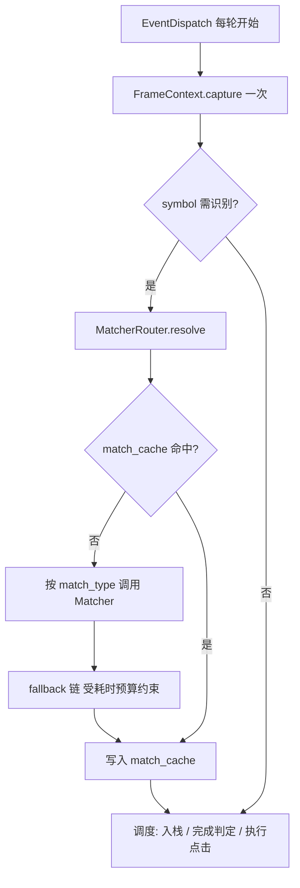
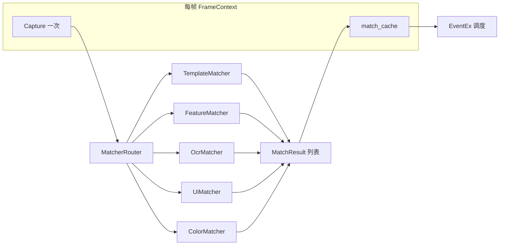
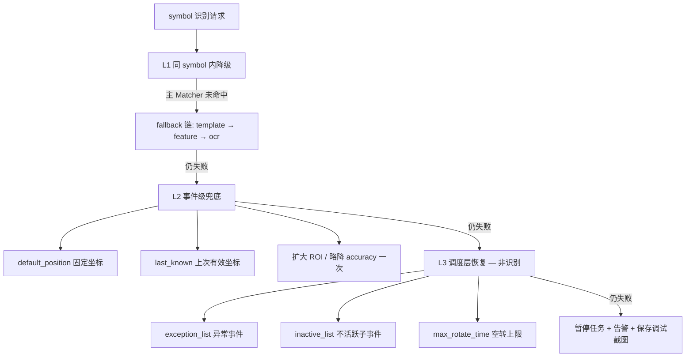
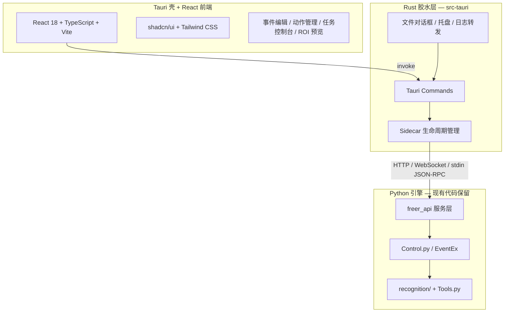

# Freer 升级计划

> 分阶段路线图与架构设计文档。  
> 当前基线：`cursor/upgrade-plan` 分支（V0.3，Phase 0–2 已落地）。

---

## 一、总体评估

Freer 的核心设计（**事件树 + 图像触发 + 栈式调度 + 异常/冷却机制**）思路清晰，适合模拟器脚本类场景。

**当前状态（V0.3）**：Phase 0–2 已完成——核心 P0 逻辑缺陷已修复，`recognition/` 多 Matcher 路由与 `freer_api` sidecar 已可用。剩余工作集中在 **Phase 3 产品化 GUI**（Tauri + React，§4.4.8）及少量 P1/P2 遗留项（§二）。

**推进顺序**：修 Bug → 稳架构 → 识别路由 → 工程化（`freer_api`）→ **GUI 产品化（路线 B）** → Phase 4 增强能力。

### 实施进度（`cursor/upgrade-plan` 分支）

| 阶段 | 版本目标 | 状态 | 关键交付 |
|------|----------|------|----------|
| Phase 0 | V0.2 | **已完成** | Drag/实例化/子事件语义/路径/截图防护 |
| Phase 1 | V0.2 | **已完成** | `recognition/`、FrameContext、TemplateMatcher、调度防抖 |
| Phase 1.5 | V0.25 | **已完成** | feature/ocr/ui/color、fallback、last_resort |
| Phase 2 | V0.3 | **已完成** | `config.yaml`、`freer_api`、`freer_log`、序列化白名单 |
| Phase 3 | V0.4 | **进行中** | GUI 页面已落地（含列表/画布事件库、可调三栏）；打包验收待完成（§4.4.8） |
| Phase 4 | — | 未开始 | 多尺度、录制、可选重型 Matcher |

> Phase 3 原则：**不限工期，优先完成度与质量**；先冻结 OpenAPI v1.1并实现 API，再开发前端。

---

## 二、问题清单

### 2.1 已解决（Phase 0–2）

| # | 问题摘要 | 修复阶段 |
|---|----------|----------|
| P0-1 | Drag 循环 `i += 2` 位置错误 | Phase 0 |
| P0-2, P0-3 | `EventEx` / 模型类级可变状态 | Phase 0 |
| P0-4 | 子事件提前移除导致父宏事件错误完成 | Phase 0 |
| P0-5 | 同 `symbol_start` 子事件歧义 | Phase 1（`priority`） |
| P0-6, P0-7 | 截图失败崩溃、Drag 除零 | Phase 0 |
| P1-1, P1-3 | `tmp_position` 过期、重复 `GetPosition` | Phase 1（帧缓存 + 执行前 resolve） |
| P1-2 | 完成判定抖动 | Phase 1（连续 N 帧防抖） |
| P1-7, P1-8 | 窗口句柄、ADB 无错误处理 | Phase 1（缓存 hwnd、`AdbClient`） |
| P1-10 | `./data/` vs `../data/` 路径分歧 | Phase 0（`paths.py`） |
| P2-1, P2-2 | 单点匹配、颜色空间 | Phase 1（TemplateMatcher + NMS） |
| P2-5, P2-9 | 序列化混入运行时字段、仅 `print` 日志 | Phase 2（白名单序列化、`freer_log`） |
| P2-7 | Add/Edit 重复代码 | Phase 2（`event_form_common.py`；完整 GUI 待 Phase 3） |

### 2.2 待处理（Phase 3+）

| # | 问题摘要 | 计划 |
|---|----------|------|
| P1-4 | `LeftClick` 原地修改 position 序号 | Phase 4 或引擎小修 |
| P1-5 | `ColdEventCape` `run_time` 无下界 | Phase 4 |
| P1-6 | 异常微事件不触发 `inactive_list` 恢复 | Phase 4 |
| P1-9 | `InputCharacter` shell 注入风险 | Phase 4（ADB 安全输入） |
| P2-3 | `GrandEvent.symbol_start` 拼接未使用 | 低优先级清理 |
| P2-4 | `type(x).__name__ == 'dict'` | 低优先级清理 |
| P2-6 | `WriteJSON` 可读性 | Phase 3 GUI 保存时处理 |
| P2-8 | 右键点击 `action_type=2` 未实现 | Phase 4 |

---

## 三、架构与流程

### 3.1 当前识别与调度流程（Phase 1+）



单帧单截屏、显式 Matcher 路由、执行前从当前帧取坐标；L1 fallback 与 L2 `last_resort` 见 §4.3.9。

---

## 四、架构设计与增强方向

### 4.1 工程现状（Phase 0–2 已落地）

| 领域 | 交付物 |
|------|--------|
| 正确性 | Drag/实例化/子事件语义修复；帧内识别缓存；完成判定防抖 |
| 识别 | `recognition/`（template / feature / ocr / ui / color）、fallback、L2 `last_resort` |
| 工程化 | `paths.py`、`config.yaml`、`freer_log`、`serialization`、白名单保存 |
| API | `freer_api`（OpenAPI v1.0）：events / actions / config / task / logs |
| 测试 | `tests/test_phase0.py`–`test_phase2.py` |

### 4.2 待增强（Phase 3–4）

| 能力 | 阶段 | 说明 |
|------|------|------|
| Tauri/React GUI | Phase 3 | 事件库、树形编排、任务控制台、ROI 实验室（§4.4） |
| OpenAPI v1.1 | Phase 3 | pause/resume、validate、preview、tree、import/export |
| 动作/任务 GUI | Phase 3 | 替代 PySide2；`View/` 标 deprecated |
| 右键/长按、录制、多尺度 | Phase 4 | 按需 |
| 跨平台纯 ADB | Phase 4 | 弱化 Win32 依赖 |

### 4.3 识别方案（多 Matcher 路由）

| 原则 | 说明 |
|------|------|
| **显式路由** | 每个 `symbol_start` / `symbol_finish` 在配置中声明 `match_type`，引擎 dispatch，不做运行时「智能猜类型」 |
| **帧内一次截屏** | `EventDispatch` 每轮构建 `FrameContext`，本帧内所有判定与动作共用同一份截图与 `match_cache` |
| **重模块懒加载** | OCR 模型、ORB detector 首次使用时初始化并单例复用；未启用的 Matcher 不占内存 |
| **ROI 优先** | 除 UI 树查询外，template / feature / ocr / color 均应在 ROI 内执行，禁止默认全屏扫描 |
| **可选 fallback 链** | 仅允许「从轻到重」顺序（如 `template → feature → ocr`），且受单帧耗时预算约束 |
| **不引入 Airtest** | 自研 `recognition/` 模块，保持与 Freer 事件树调度解耦 |

#### 4.3.2 目标架构



**目录结构（当前）**：

```
freer/
├── Control.py, Models.py, Tools.py, main.py
├── paths.py, config.py, config.yaml
├── freer_log.py, serialization.py
├── recognition/
│   ├── types.py, router.py, frame.py, parse.py
│   ├── fallback.py, last_known.py, position_utils.py
│   ├── adb_client.py
│   └── matchers/          # template, feature, ocr, ui, color, roi
├── freer_api/             # FastAPI sidecar（OpenAPI v1.0）
├── View/                  # PySide2 过渡 GUI；Phase 3 后 deprecated
├── data/, img/
├── tests/test_phase0.py … test_phase2.py
├── gui/                   # Phase 3 新建
└── src-tauri/             # Phase 3 新建
```

#### 4.3.3 Matcher 分级与场景路由

| match_type | 典型耗时 | 适用场景 | 备注 |
|------------|----------|----------|------|
| **color** | < 1 ms | 固定色块、红点、状态条 | 最轻量，优先于 template |
| **template** | 5–20 ms | 固定 icon、UI 基本不变 | 默认首选；须配合 ROI + 多实例 NMS |
| **feature** | 10–30 ms | 轻微缩放 / 动效帧 | ORB；仅小模板 + ROI |
| **ui** | 10–50 ms | 系统弹窗、原生 Android 控件 | uiautomator2；与 ADB 坐标体系一致 |
| **ocr** | 30–150 ms | 文字按钮、动态数值 | PaddleOCR；**必须 ROI**；可每 N 帧降频 |

**路由经验规则**（写入 README / 配置说明）：

- 能 **ui** 就不 **ocr**
- 能 **ROI** 就不全屏
- 能 **template** 就不 **feature**
- 能 **color** 就不 **template**

**默认不纳入方案**（开销过大或需 GPU）：

- CLIP / 多模态语义匹配
- 全屏 YOLO 每帧检测
- 全图 SIFT 扫描
- 全屏 OCR

以上可作为 Phase 4+ 可选插件，**默认关闭**。

#### 4.3.4 统一数据结构与接口

```python
@dataclass
class Rect:
    index: int       # 多目标序号
    x1, y1, x2, y2: int
    score: float
    source: str      # template | feature | ocr | ui | color

@dataclass
class SymbolSpec:
    type: str                    # template | feature | ocr | ui | color
    target: str                  # 图片路径 | 文字 | resource-id | #RRGGBB
    accuracy: float = 0.85
    roi: list | None = None      # [x1, y1, x2, y2] 设备坐标
    index: int = 0               # 同屏多实例取第几个
    fallback: list | None = None # 如 ["feature", "ocr"]

class BaseMatcher:
    def match(self, frame: FrameContext, spec: SymbolSpec) -> list[Rect]: ...
```

`EventEx.GetPosition()` 解析 `SymbolSpec` 并调用 `MatcherRouter.resolve()`；返回值保持 `[index, x1, y1, x2, y2]` 以兼容调度逻辑。

#### 4.3.5 配置格式（向后兼容）

**旧格式**（继续支持）：

```json
"symbol_start": "../img/btn.bmp|../img/btn2.bmp"
```

解析为 `match_type: template`，`|` 分隔多模板。

**新格式（对象）**：

```json
"symbol_start": {
  "type": "ocr",
  "target": "讨伐",
  "accuracy": 0.9,
  "roi": [200, 800, 880, 1200],
  "index": 0,
  "fallback": ["template"]
}
```

**新格式（扁平字段，便于 GUI）**：

```json
"match_type_start": "ocr",
"symbol_start": "讨伐",
"roi_start": [200, 800, 880, 1200],
"match_fallback_start": "template|../img/讨伐.bmp"
```

`symbol_finish`、宏事件子事件触发条件共用同一套 `SymbolSpec` 解析。

#### 4.3.6 性能预算

```python
MAX_MATCH_MS_PER_SYMBOL = 80    # 单个 symbol（含 fallback 链）上限
MAX_MATCH_MS_PER_FRAME = 200    # 整帧所有识别总和上限
```

fallback 链累计超时则本帧该 symbol 判定为未命中，下帧重试；避免单帧 template → feature → ocr 拖死主循环。

OCR 可选策略：上帧 ROI 内高置信命中则本帧 skip；或每 2–3 帧全量 OCR 一次。

#### 4.3.7 与调度层的衔接（已实现）

| 调度点 | 行为 |
|--------|------|
| `EventDispatch` | 每轮 `FrameContext.capture()` + `match_cache` |
| `EventIsFinish` | 读缓存；连续 N 帧防抖 |
| `AddNextEvent` | 合并 `GetPosition`；`priority` + `index` |
| `DoMicroEvent` | 执行前从当前帧 Router resolve 坐标 |

#### 4.3.8 依赖（按需安装）

| 依赖 | 用途 | 安装策略 |
|------|------|----------|
| `opencv-python` | template / feature | 已有 |
| `paddleocr` | ocr Matcher | 可选依赖，懒加载 |
| `uiautomator2` | ui Matcher | 可选依赖，仅 `match_type=ui` 时需要 |

不引入 Airtest、不默认引入 PyTorch / YOLO。

#### 4.3.9 兜底识别策略

> **结论：要考虑，但必须分层。**  
> 「兜底」不等于「失败后自动试遍所有 Matcher」——那样会击穿 §4.3.6 性能预算，并提高误触概率。  
> 正确做法是：**识别层兜底**（单 symbol 内）与 **调度层恢复**（宏事件级）分工，二者不要混为一谈。

##### 三层兜底模型



| 层级 | 职责 | 触发条件 | 开销 |
|------|------|----------|------|
| **L1** symbol 内 fallback | 换一种 Matcher 再试 | 主 `match_type` 未命中 | 中（受 80 ms 预算约束） |
| **L2** 事件级兜底 | 不依赖当前帧图像的坐标回退 | L1 全链失败 | 极低 |
| **L3** 调度层恢复 | 换事件路径或中止任务 | 无法入栈 / 长期空转 | 无额外识别 |

Freer **沿用** L3 机制（`exception_list`、`inactive_list`、`max_rotate_time`）；L1/L2 已在 Phase 1–2 落地。

##### L1：symbol 内 fallback（已实现）

- 仅允许配置声明的 `fallback` 列表，**禁止** Router 自动遍历全部 Matcher。
- fallback 顺序固定为从轻到重；累计超时则本帧判定未命中，**下帧重试**，不在同一帧无限降级。
- 可选：fallback 步骤允许 **accuracy 略降一次**（如 `-0.05`），须记录日志；不允许无限降阈值。

```python
@dataclass
class SymbolSpec:
    ...
    fallback: list | None = None
    fallback_accuracy_delta: float = 0.05   # 每步降级允许降低的阈值，仅 fallback 链内生效
    max_fallback_steps: int = 2             # 除主 Matcher 外最多再试几步
```

##### L2：事件级兜底（已实现）

当 L1 全链失败后，在 **微事件 / 子事件** 上按配置选择：

| `last_resort` 值 | 行为 | 适用 |
|------------------|------|------|
| `none`（默认） | 本帧未命中，交给调度层空转 / 异常 | 大多数事件 |
| `default_position` | 使用事件配置的固定坐标执行 | 按钮位置固定、识别偶发失败 |
| `last_known` | 使用最近一次成功识别的坐标（带 TTL） | 界面微动、识别抖动 |
| `expand_roi` | ROI 各边扩展固定像素后再试 **一次**（仍走主 Matcher） | 动画导致目标偏出 ROI |
| `pause` | 立即暂停任务并告警 | 关键步骤，禁止盲点 |

```json
{
  "symbol_start": { "type": "template", "target": "../img/btn.bmp", "roi": [100, 200, 300, 400] },
  "last_resort_start": "default_position",
  "default_position": [150, 250, 200, 300]
}
```

**`last_known` 约束**（避免点到过期位置）：

- 仅复用 **同一 symbol、同一 match_type** 的上次结果；
- TTL 默认 3 帧或 2 秒（可配置）；
- 完成出栈后清除，防止下一事件误用。

##### L3：调度层恢复（沿用并强化）

识别全失败 **不直接崩溃**，按现有顺序：

1. 扫描 `exception_list`（弹窗、网络错误等）
2. 扫描 `inactive_list`
3. `has_rotate_time += 1`，未超 `max_rotate_time` 则下帧再试
4. 超限或连续 N 帧全局未命中 → **暂停任务** + 结构化日志 + 保存当前截图到 `logs/debug/`

建议在 `config.yaml` 增加任务级阈值：

```yaml
recognition:
  max_consecutive_miss_frames: 30    # 连续无命中帧数，触发暂停
  on_task_pause: save_screenshot     # 保存调试截图
  last_known_ttl_frames: 3
```

##### 不建议作为兜底的做法

| 做法 | 原因 |
|------|------|
| 失败后自动尝试全部 Matcher | 开销不可控，违背显式路由 |
| 无 TTL 复用旧坐标 | 界面切换后误点 |
| 无限降低 accuracy | 误触率陡增 |
| 兜底链中默认启用 OCR | OCR 慢，应用户显式配置 |
| 识别失败仍强制点击 (0,0) | 危险；必须 `pause` 或跳过 |

##### 与 `DoMicroEvent` 的调用顺序

```python
def resolve_for_action(self, spec, event):
    rects = router.resolve(frame, spec)           # L1
    if not rects and spec.last_resort == "expand_roi":
        rects = router.resolve(frame, spec.with_expanded_roi())  # L2 一次
    if not rects and spec.last_resort == "last_known":
        rects = last_known_cache.get(spec.key, ttl=...)
    if not rects and spec.last_resort == "default_position":
        rects = event.default_position_as_rects()
    if not rects and spec.last_resort == "pause":
        raise TaskPausedError(...)
    return rects  # 空则调度层走 L3，不执行点击
```

##### 兜底实施状态

| 阶段 | 状态 | 交付 |
|------|------|------|
| Phase 1 | 已完成 | L1 fallback + 性能预算 |
| Phase 1.5 | 已完成 | L2 `default_position` / `expand_roi` / `last_known` |
| Phase 2 | 已完成 | L3 `max_consecutive_miss_frames`、调试截图、暂停任务 |
| Phase 3 | 待实施 | GUI 配置 `last_resort`、fallback 链可视化 |

### 4.4 GUI 升级方案（路线 B：Python 引擎 + Tauri/React 界面）

> **选定策略**：GUI 产品化采用 **路线 B**——保留现有 Python 引擎（`Control.py` / `Tools.py` / `recognition/`），界面层用 **Tauri 2 + React** 重写；Rust 仅承担 Tauri 要求的原生壳与 IPC 胶水，**不重写调度与识别逻辑**。  
> 视觉参考 [CC Switch](https://github.com/farion1231/cc-switch)（Tauri 2 + React + shadcn/ui）；Freer 与之差异在于业务后端仍为 Python sidecar，而非 Rust 全栈（路线 C）。

#### 4.4.1 方案对比（为何选 B）

| 路线 | 界面 | 引擎 | Rust 工作量 | 适用 |
|------|------|------|-------------|------|
| **A** PySide6 渐进美化 | Qt Widgets | Python | 无 | 改动最小，视觉上限低于现代 Web UI |
| **B** Python + Tauri/React | React + shadcn/ui | **Python 保留** | 薄（IPC、进程、文件） | **Freer 当前选定**；引擎不动，换脸 + 产品化 |
| **C** Tauri 全栈 | React + shadcn/ui | **Rust 重写** | 厚（调度、识别、Win32） | 长期产品、小包体；工作量数倍于 B |

**路线 B 为何涉及 Rust**：并非引擎需要 Rust，而是 **Tauri 框架本身**要求一层 Rust 运行时（窗口、WebView、sidecar、系统 API）。B 中 Rust 不写业务，只写「启动 Python、转发命令、读文件、系统托盘」等胶水代码。若完全不想碰 Rust，可改用 Electron 或 pywebview，但会失去 Tauri 的小体积与原生集成优势。

#### 4.4.2 目标架构



**职责划分**：

| 层 | 技术 | 职责 |
|----|------|------|
| **前端** | React 18、TypeScript、Vite、Tailwind CSS 3.4、shadcn/ui、TanStack Query、react-hook-form、zod | 表单、事件树、模板预览、ROI 选框、任务控制台、日志流 |
| **胶水** | Tauri 2、Rust（serde、tokio、tauri-plugin-shell/log/dialog） | 窗口与 WebView、启动/监控 Python sidecar、IPC 转发、本地文件与托盘 |
| **引擎** | Python 3、`Control.py`、`Models.py`、`Tools.py`、`recognition/` | 事件 CRUD、调度运行、OpenCV/ADB/Win32、识别路由 |

#### 4.4.3 前端技术栈（对齐 CC Switch 视觉）

| 类别 | 选型 | 用途 |
|------|------|------|
| 框架 | React 18 + TypeScript | 组件化界面 |
| 构建 | Vite | 开发与打包 |
| 样式 | Tailwind CSS 3.4 | spacing / color / 暗色模式 |
| 组件 | shadcn/ui（Radix UI） | Button、Dialog、Form、Tabs、Tree 等 |
| 数据 | TanStack Query v5 | 事件/动作列表缓存与刷新 |
| 表单 | react-hook-form + zod | 校验与类型安全 |
| 拖拽 | @dnd-kit | 子事件 / 异常列表排序 |
| 图标 | lucide-react | 与 shadcn 配套 |

#### 4.4.4 Python ↔ 前端 IPC 设计

引擎对外暴露 **稳定 API 边界**，GUI 不直接 import `Control.py`，统一经 `freer_api/` 服务层调用。

**推荐传输**：开发期 **本地 HTTP（FastAPI / uvicorn）** 或 **WebSocket**（任务日志流）；Tauri sidecar 启动 Python 进程并监听固定端口（如 `127.0.0.1:17890`）。备选：stdin/stdout JSON-RPC（调试简单，但不利于日志流）。

**API 分组**：

| 模块 | 方法示例 | v1.0 | v1.1 |
|------|----------|:----:|:----:|
| 配置 | `GET/PUT /config` | ✓ | |
| 事件 CRUD | `GET/POST/PUT/DELETE /events` | ✓ | |
| 动作 CRUD | `GET/POST/PUT/DELETE /actions` | ✓ | |
| 模板/截屏 | `GET /templates`、`POST /capture` | ✓ | |
| 任务 | `POST /task/start`、`POST /task/stop`、`GET /task/status` | ✓ | pause/resume、状态扩展 |
| 日志 | `WS /logs` | ✓ | |
| 健康 | `GET /health` | ✓ | |
| 编排树 | `GET /events/{name}/tree` | | ✓ |
| 校验 | `POST /events/validate` | | ✓ |
| 识别预览 | `POST /recognize/preview` | | ✓ |
| 静态资源 | `GET /assets/img/{path}` | | ✓ |
| 导入导出 | `POST /export`、`POST /import` | | ✓ |

**OpenAPI 版本**：

| 版本 | 范围 | 说明 |
|------|------|------|
| **v1.0** | Phase 2 已交付 | events/actions/config/task/health/logs |
| **v1.1** | Phase 3 冻结 | 上表新增端点 + task 状态机扩展；破坏性变更升 v2 |

**类型同步（已定案）**：前端使用 `openapi-typescript` 从 `/openapi.json` 生成 `gui/src/api/types.ts`；UI 层用 zod 做表单校验，以生成类型为源，CI 做契约回归。

**响应约定**：JSON 统一 `{ "ok": true, "data": ... }` / `{ "ok": false, "error": { "code", "message" } }`；引擎异常映射为 HTTP 4xx/5xx，不向前端抛 Python traceback。

**Sidecar 生命周期**：

1. Tauri 启动 → Rust 拉起 Python sidecar（`python -m freer_api` 或 PyInstaller 单文件）
2. 健康检查 `GET /health` 通过后前端才渲染主界面
3. 应用退出 → Rust 发送 `POST /shutdown` 并等待进程结束
4. Sidecar 崩溃 → 前端告警 + Rust 可选自动重启（限次数）

#### 4.4.5 目录结构

Phase 3 完成后目标布局（引擎保持根目录，**不**迁入 `engine/` 子包）：

```
freer/
├── Control.py, Models.py, Tools.py, recognition/, freer_api/   # 现有引擎
├── paths.py, config.yaml, freer_log.py, serialization.py
├── gui/                        # Phase 3：React + shadcn
│   └── src/pages/              # EventEditor / TaskConsole / TemplateLab
├── src-tauri/                  # Phase 3：sidecar 生命周期、薄 commands
├── data/, img/
└── View/                       # deprecated（Phase 3 后）
```

#### 4.4.6 与分阶段路线图的衔接

| 阶段 | GUI 相关交付 | 状态 |
|------|--------------|------|
| **Phase 2** | `freer_api` v1.0、`event_form_common` | 已完成 |
| **Phase 3** | `gui/` + `src-tauri/`、树形编排、v1.1 API | 进行中（v1.1 API + 脚手架已落地） |
| **Phase 4+** | 录制向导、Web 远程控制台 | 未开始 |

#### 4.4.7 风险与缓解（路线 B 专项）

| 风险 | 缓解 |
|------|------|
| IPC 协议频繁变动 | Phase 2 冻结 OpenAPI v1.0；**Phase 3 开工前冻结 v1.1**；破坏性变更升版本 |
| Sidecar 启动失败 | 健康检查 + 明确错误 UI；日志写 `%APPDATA%/freer/logs` |
| 双进程调试复杂 | **双模式开发（已定案 B）**：集成模式 `pnpm tauri dev` 自动起 sidecar；前端模式 `pnpm dev` + 手动 `python -m freer_api`；见 §4.4.8.1 |
| Python 打包跨机器差异 | CI 打 Windows 安装包；文档列 OpenCV/ADB 前置条件 |
| Rust 胶水维护成本 | 严格限制 `src-tauri` 职责，业务逻辑禁止写入 Rust |
| 与路线 C 混淆 | 文档明确：B 的 Rust 仅胶水；引擎迁移 Rust 属 Phase 4+ 可选演进 |

**可选演进 B → C**：API 稳定后，可将 `freer_api` 背后实现逐模块换为 Rust，最终去掉 Python sidecar；非 Phase 3 范围。

#### 4.4.8 Phase 3 详细设计（已定案）

> **原则**：不限工期，优先完成度与质量。React 只调 HTTP/WebSocket；Rust 只写胶水；业务留在 Python。

##### 4.4.8.1 开发模式（双模式 B）

| 模式 | 命令 | 用途 |
|------|------|------|
| **集成模式** | `pnpm tauri dev` | Tauri 启动 sidecar；`GET /health` 通过后渲染主界面；贴近生产 |
| **前端模式** | `python -m freer_api` + `pnpm dev` | 日常 UI 开发；Vite 代理 API |

Sidecar 崩溃：全屏错误态 + 重试；禁止 silent fail。

##### 4.4.8.2 事件库与树形编排编辑器（已定案：树形，非纯表单）

`event.json` 为**扁平事件目录**；宏事件的 `event_list` / `exception_list` 为**引用 + 运行参数**。编辑器编排的是「某个宏事件的组合视图」，不是把整个 JSON 变成一棵树。

**列表模式 — 三栏布局（已实现，列宽可拖拽调节）**：

```
┌─────────────┬──────────────────────┬─────────────────┐
│ 事件目录     │  编排树（当前宏事件）   │  属性面板        │
│ 搜索/新建    │  子事件 / 异常分支     │  选中节点字段     │
│ 列表/画布切换 │  DnD 排序 / 宏嵌套展开  │  识别/ROI 字段   │
└─────────────┴──────────────────────┴─────────────────┘
```

列宽持久化键：`freer.events.sidebarWidth`、`freer.events.composeWidth`（`localStorage`）。

**画布模式 — 树形可视化（已实现）**：

- 右侧两栏合并为可缩放 / 平移的节点画布（ComfyUI 工作流风格）
- 单击节点在右侧属性面板编辑，**不跳转**；保存针对当前选中节点
- 子事件实线连接，异常分支琥珀色虚线；宏/微/异常节点分色

| 节点类型 | 列表模式 | 画布模式 |
|----------|----------|----------|
| 子微事件 | 叶子，可展开动作提示 | 绿色节点 |
| 子宏事件 | 可展开，递归展示下级 | 蓝色节点，可嵌套展开 |
| 异常事件 | 独立色带/分支 | 琥珀色节点 + 虚线 |
| 编排元数据 | `should_run_time` / `max_run_time` / `priority` 侧栏 | 节点副标题摘要 |

**交互（列表）**：下拉添加子事件/异常；拖拽排序；点击事件名深入（面包屑）；保存前校验（`POST /events/validate`）。

**交互（画布）**：滚轮缩放、拖拽平移、单击选中编辑；根宏来自左侧目录选中项。

**前端实现**：`gui/src/pages/EventsPage.tsx`、`CompositionTreeView.tsx`、`EventGraphEditor.tsx`、`eventGraphLayout.ts`。

**待增强**：从目录拖入子事件；保存前环检测可视化；画布上直接增删节点。

**实施顺序**：~~单事件属性表单~~ → ~~树形编排~~ → ~~画布视图~~ → 环检测 / 拖入 / 打包验收。

##### 4.4.8.3 任务控制：软暂停 vs 硬停止

| 操作 | API | 语义 |
|------|-----|------|
| **软暂停** | `POST /task/pause` | 保留 `stack` 与编排状态；在 **EventDispatch 帧边界**生效；当前微事件跑完后进入 paused |
| **恢复** | `POST /task/resume` | 从暂停点继续 |
| **硬停止** | `POST /task/stop` | 不可恢复；安全点清空栈，重置 runner |

**状态机**：`idle` → `running` ⇄ `paused` → `stopping` → `idle`；以及 `completed` / `error`。

`GET /task/status` 扩展：`route`（当前 `GetEventRoute()`）、`pause_pending`（已请求暂停，等待微事件结束）、`current_event`。

**UI 映射**：running → Pause + Stop；paused → Resume + Stop；idle → Start。

##### 4.4.8.4 单窗口信息架构

| 导航 | 内容 |
|------|------|
| 事件库 | 目录 + 列表三栏编排 + 画布树形视图 + 属性（§4.4.8.2） |
| 动作 | 动作 CRUD |
| 任务 | 根事件、repeat、控制台、WS 日志 |
| 模板/ROI | 图库、截屏、Canvas 选框、preview |
| 设置 | `config.yaml`、data 路径、ADB |

##### 4.4.8.5 打包与部署（已定案）

1. `pyinstaller` → `freer-engine.exe`（sidecar）
2. `pnpm build` + `pnpm tauri build` → 捆绑 sidecar → Windows NSIS
3. 干净 VM 验收；ADB 由用户自备

| 项 | 说明 |
|----|------|
| 体积预期 | **80–150MB**（含 Python + OpenCV） |
| 开发环境 | Node 18+、pnpm、Rust 1.85+、Tauri CLI 2.8+、Python 3.10+ |
| 旧 GUI | Phase 3 完成前保留 `View/` 作 fallback |

##### 4.4.8.6 实施顺序（按依赖，非工期）

```
0. OpenAPI v1.1 + pause/resume + validate + preview + tree API
1. Tauri 脚手架 + 双模式 + health 门控
2. openapi-typescript + 设置页 + 动作 CRUD
3. 事件属性表单（微/宏 + 识别高级字段）
4. 树形编排编辑器（DnD + 异常 + 环检测 + 画布视图）— 除环检测外已落地
5. 任务控制台 + WS 日志
6. 模板/ROI 实验室
7. 导入/导出 zip
8. PyInstaller + Tauri 打包 + VM 验收
9. PySide deprecated + 文档
```

##### 4.4.8.7 建议 PR 切分

| PR | 内容 |
|----|------|
| engine-api-v1.1 | pause/resume、validate、preview、tree、assets、import/export |
| tauri-scaffold | 双模式、health、崩溃 UI |
| gui-foundation | 类型生成、布局、设置、动作 |
| event-forms | 微/宏属性 + 识别字段 |
| event-tree-editor | 三栏树形编排 + 可调列宽 + 画布视图（**已实现**） |
| task-console | 状态机 UI + 日志 |
| template-roi-lab | Canvas + preview |
| import-export | 事件包 |
| packaging-windows | PyInstaller + Tauri |
| docs-deprecate-pyside | README 迁移 |

---

## 五、分阶段路线图

### Phase 0–2 — 已完成

| 阶段 | 版本 | 测试 | 要点 |
|------|------|------|------|
| **0** 紧急修复 | V0.2 | `test_phase0` | Drag、实例化、子事件语义、`paths.py`、截图防护 |
| **1** 调度与识别 | V0.2 | `test_phase1` | `recognition/`、帧缓存、TemplateMatcher、priority、防抖、ADB |
| **1.5** 多 Matcher | V0.25 | `test_phase15` | feature/ocr/ui/color、fallback、L2 `last_resort` |
| **2** 工程化 | V0.3 | `test_phase2` | `config.yaml`、`freer_log`、序列化、`freer_api` v1.0 |

验收项均已通过（见 `tests/`）。

---

### Phase 3 — 产品化 GUI（路线 B：Tauri + React）

**目标**：交付 Tauri + React GUI（§4.4.8）；`freer_api` v1.1；旧 PySide2 标 `deprecated`。不限工期，优先完成度与质量。

**里程碑与 PR 切分**：见 §4.4.8.6、§4.4.8.7。

**验收标准**：

- [x] 不启动 PySide 即可完成：事件库、**树形编排**、动作 CRUD、识别配置、ROI、任务运行、日志
- [x] Sidecar 异常退出时界面有明确提示，可重试，不 silent fail
- [x] 软暂停后可 Resume 并从帧边界继续；硬 Stop 不可恢复
- [x] ROI 选框保存后引擎识别正确；`recognize/preview` 与引擎一致
- [x] 编排保存通过 `POST /events/validate`（环、引用、ROI）
- [ ] 干净 Windows 环境可安装运行（文档列 ADB/OpenCV 前置）
- [ ] `openapi-typescript` 生成类型与 `/openapi.json` 同步（CI 契约检查）

---

### Phase 4 — 高级能力（按需）

| 任务 | 优先级 | 说明 |
|------|--------|------|
| 多尺度 template | 中 | 模板 0.8x–1.2x 缩放匹配，应对分辨率差异 |
| 纯 ADB 输入模式 | 中 | 全链路 adb tap/swipe，与截屏坐标统一 |
| 录制向导 | 低 | 截屏选点 + ROI → 自动生成微事件与 SymbolSpec |
| 插件化 Matcher | 低 | 自定义 Python Matcher hook 注册到 Router |
| YOLO / CLIP 检测 | 低 | **默认关闭**的可选插件；仅复杂自绘 UI 且用户显式启用 |
| 插件化动作 | 低 | 自定义 Python 脚本动作 hook |

---

## 六、风险与依赖

| 风险 | 缓解措施 |
|------|----------|
| OpenCV/ADB 环境差异 | CI 测纯逻辑；集成测试文档化手动步骤 |
| GUI 重构工作量大 | 路线 B：API 已就绪；按 §4.4.8 PR 切分渐进交付 |
| Sidecar / IPC 不稳定 | OpenAPI v1.0 已冻结；v1.1 开工前冻结；见 §4.4.7 |
| Python sidecar 打包体积大 | PyInstaller + 文档化依赖；Phase 4+ 可选 B→C |
| 识别配置行为变化 | 旧字符串 `symbol_start` 默认 template；README 迁移示例 |
| OCR / uiautomator2 可选依赖 | `requirements-optional.txt`；缺失时跳过并告警 |
| fallback / last_resort 误点 | 性能预算 §4.3.6；`last_known` TTL；关键步骤默认 `pause` |
| 子事件语义变更影响旧脚本 | 必要时 `legacy_mode` 开关（未实现，按需） |

---

## 七、当前优先级

```
Phase 3（进行中）
  → engine-api-v1.1
  → tauri-scaffold → gui-foundation → event-forms → event-tree-editor
  → task-console → template-roi-lab → import-export → packaging-windows

Phase 4（按需）
  → 多尺度 template / 纯 ADB / 录制 / 插件化 Matcher
  → §二 遗留 P1/P2 小修
```

---

## 八、版本目标

| 版本 | 主题 | 状态 | 关键交付 |
|------|------|------|----------|
| **V0.2** | 稳定版 | **已达成** | Phase 0 + Phase 1 |
| **V0.25** | 识别版 | **已达成** | Phase 1.5 多 Matcher 路由 |
| **V0.3** | 工程版 | **已达成** | Phase 2：`config`、`freer_api`、日志、序列化 |
| **V0.4** | 工具版 | 进行中 | Phase 3：Tauri/React + 树形编辑器 + v1.1 API（§4.4.8） |
| **V1.0** | 正式版 | — | 文档齐全、核心场景验证、P0/P1 清零 |

---

*文档维护：`cursor/upgrade-plan` 分支。§4.3 识别路由、§4.4 GUI（路线 B）、§4.4.8 Phase 3 已定案。Phase 0–2 已合并；下一步：冻结并实现 OpenAPI v1.1。*
