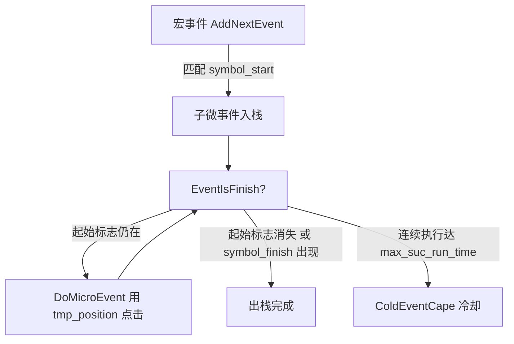
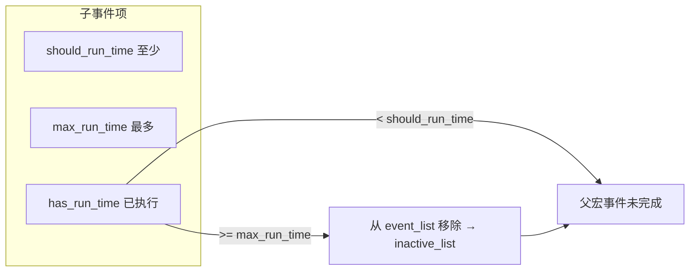

# Freer 升级计划

> 基于 V0.1 代码审阅的逻辑问题分析与分阶段改进路线图。  
> 审阅范围：`Control.py`、`Models.py`、`Tools.py`、`View/*`、`main.py`

---

## 一、总体评估

Freer 的核心设计（**事件树 + 图像触发 + 栈式调度 + 异常/冷却机制**）思路清晰，适合模拟器脚本类场景。但当前实现处于**原型阶段**：多处存在确定性逻辑缺陷、状态管理隐患和工程化缺失，在复杂任务或长时间运行下容易出现**误点击、死循环、状态串扰**等问题。

建议按 **「修 Bug → 稳架构 → 补工程 → 扩能力」** 四阶段推进，优先修复会影响正确性的逻辑问题，再考虑功能扩展。

---

## 二、逻辑问题清单

### 2.1 严重（P0）— 会直接导致错误行为

| # | 位置 | 问题 | 影响 |
|---|------|------|------|
| P0-1 | `ActionEx.Drag` L31–58 | `i += 2` 写在 `for j in range(action.run_time)` **内部** | `run_time > 1` 时索引跳跃错误，可能 **IndexError** 或跳过拖拽点对；同一对坐标被重复拖拽 |
| P0-2 | `EventEx` L98–109 | `stack`、`event_tree_template`、`run_time` 等定义为 **类变量** | 多任务/多实例时 **共享同一栈与状态**，后启动的任务污染先启动的任务 |
| P0-3 | `Models.GrandEvent` / `MicroEvent` / `Action` | `event_list`、`has_rotate_time`、`action`、`hwnd` 等作为 **类属性** | 实例间可能共享可变状态；`SetByDict` 行为不一致 |
| P0-4 | `CountAndClearRedundant` + `EventIsFinish` | 子事件 `has_run_time >= max_run_time` 时从 `event_list` **移除**，但父宏事件完成条件仍要求剩余子事件 `has_run_time >= should_run_time` | 当 `max_run_time < should_run_time` 或子事件提前被移除时，父事件可能 **在未满足最少执行次数的情况下完成** |
| P0-5 | `AddNextEvent` L241–247 | 多个子事件 **共用相同 `symbol_start`** 时，按列表顺序取第一个匹配 | 无法区分应执行哪个分支（`main.py` 已注释此问题） |
| P0-6 | `ImageTool.FindImage` L80 | `cv2.imread('sc.bmp')` 失败时返回 `None`，未校验 | **AttributeError** 导致任务崩溃 |
| P0-7 | `ActionEx.Drag` L42–50 | 起点终点相同或 `abs(y1-y2)==0` / `abs(x1-x2)==0` 时除零 | 拖拽动作异常中断 |

### 2.2 中等（P1）— 边界场景或长期运行风险

| # | 位置 | 问题 | 影响 |
|---|------|------|------|
| P1-1 | `DoMicroEvent` L305 | 执行时使用 `tmp_position`（入栈时缓存），非实时重识别 | 界面动画/滚动后点击 **偏移或点到错误区域** |
| P1-2 | `EventIsFinish` 微事件无 `symbol_finish` | 以「起始标志消失」作为完成条件 | 识别抖动时可能在「未完成 / 已完成」间 **反复横跳** |
| P1-3 | `AddNextEvent` L244–245 | 同一帧内对同一目标 **调用两次** `GetPosition` | 性能浪费；极端情况下两次结果不一致 |
| P1-4 | `ActionEx.LeftClick` L14 | `position[i][0] = 0` **原地修改**序号字段 | 若 position 被复用，后续逻辑坐标序号错乱 |
| P1-5 | `ColdEventCape` L361 | 冷却回退时 `run_time -= 1` | 无下界保护，可能出现 **负数计数**，冷却逻辑失效 |
| P1-6 | `RecoverExceptionEvent` L375 | 仅 `is_exception and event_type==0`（异常宏事件）触发恢复 | **异常微事件** 执行后不会恢复 `inactive_list` |
| P1-7 | `GetWindowHwnd` | 窗口未找到时仅 print，仍继续执行 | 向 **hwnd=0/None** 发消息，行为不可预期 |
| P1-8 | `Tools.ImageTool.Capture` | `os.system('adb ...')` 无返回值检查 | ADB 断连时静默失败，后续识别全部失效 |
| P1-9 | `ActionTool.InputCharacter` | `os.system('adb shell input text ' + c)` | 特殊字符注入失败；**shell 注入**风险 |
| P1-10 | 路径硬编码 | `EventEx` 用 `./data/`，`DataManager` 用 `../data/` | 工作目录不同则 **读写不同文件** 或找不到文件 |

### 2.3 较轻（P2）— 设计/可维护性问题

| # | 位置 | 问题 |
|---|------|------|
| P2-1 | `ImageTool.FindImage` | `hwnd` 参数未使用；每模板只取 `minMaxLoc` 单个匹配点 |
| P2-2 | `ImageTool.FindImage` L80 | 对 BGR 图使用 `COLOR_RGBA2RGB`，颜色空间处理不当 |
| P2-3 | `GrandEvent.symbol_start` L165 | 拼接子事件标志，调度逻辑中 **未实际使用** |
| P2-4 | `type(x).__name__ == 'dict'` | 脆弱的类型判断，应使用 `isinstance` |
| P2-5 | `DataManager.AddObj` | `obj.__dict__` 序列化，易混入运行时字段（`hwnd`、`has_rotate_time` 等） |
| P2-6 | `FileTool.WriteJSON` | 无缩进、`ensure_ascii=True` 默认，中文可读性差 |
| P2-7 | GUI | `AddEvent.py` / `EditEvent.py` 大量重复代码；无动作管理界面 |
| P2-8 | 动作类型 | 注释提到 `action_type=2` 右键，**未实现** |
| P2-9 | 日志 | 仅 `print`，无级别、无文件、无法回溯 |

---

## 三、架构与流程问题（图示）

### 3.1 微事件生命周期（当前）



**问题**：`tmp_position` 在入栈时写入，执行阶段不刷新；完成判定与执行使用不同帧的识别结果，易产生竞态。

### 3.2 子事件计数与移除（当前）



**问题**：被移除的子事件不再参与父事件完成检查，「至少 N 次」约束可能被绕过。

---

## 四、可优化与增强方向

### 4.1 正确性

- 统一 **单次截屏 → 单次识别 → 结果缓存** 供本帧内所有判断与动作使用
- 子事件匹配引入 **优先级 / 互斥组 / 多模板联合条件**（AND/OR）
- 明确 `should_run_time` 与 `max_run_time` 语义：移除前必须校验 `has_run_time >= should_run_time`
- 拖拽、点击动作增加 **边界与除零保护**

### 4.2 性能

- ADB 截屏改为 `subprocess` + 管道读 bytes，避免写盘 `sc.bmp`
- 模板预加载与缓存；ROI 区域限制搜索范围
- 减少 `EventDispatch` 每轮重复 IO（窗口句柄缓存、配置热加载开关）

### 4.3 工程化

- 引入 `config.yaml`：ADB 设备 ID、数据目录、默认精度、日志路径
- 路径基于 **项目根目录** 解析，消除 `./` vs `../` 分歧
- `requirements.txt` + 最低 Python 版本说明
- 结构化日志（`logging`）与可选 GUI 日志面板
- 单元测试覆盖：`GetRandomPosition`、事件树构建、完成判定、Drag 索引逻辑

### 4.4 功能扩展

| 能力 | 说明 |
|------|------|
| 动作管理 GUI | 增删改 `action.json`，与事件 GUI 对称 |
| 任务运行 GUI | 选择根事件、重复次数、开始/停止/暂停 |
| 右键点击 / 长按 | 补全 `action_type=2` 等 |
| 多匹配点 | 同屏多个相同按钮时按序号或最近邻选择 |
| OCR 条件 | 除模板匹配外支持文字触发 |
| 录制回放 | 截屏选点 → 自动生成微事件 |
| 跨平台 | macOS/Linux 通过纯 ADB 输入输出，弱化 Win32 依赖 |

---

## 五、分阶段升级路线图

### Phase 0 — 紧急修复（1–2 周）

**目标**：消除确定性 Bug，保证单任务、单实例基本可用。

| 任务 | 对应问题 | 建议改动 |
|------|----------|----------|
| 修复 Drag 循环 | P0-1 | 将 `i += 2` 移出 `run_time` 内层循环；补充单点拖拽保护 |
| 实例化状态 | P0-2, P0-3 | `EventEx.__init__` 中初始化 `self.stack=[]` 等；模型类去掉类级可变默认值 |
| 子事件完成语义 | P0-4 | 移除子事件前断言 `has_run_time >= should_run_time`；或改为仅标记 inactive 不移除 |
| 图像读取防护 | P0-6 | `imread` 失败时重试截屏或抛出自定义异常并中止任务 |
| 除零保护 | P0-7 | Drag 中检测起终点距离，过近则跳过或瞬移 |
| 路径统一 | P1-10 | 新增 `paths.py` 或 `config`，全局使用 `PROJECT_ROOT / "data" / ...` |

**验收标准**：

- [ ] `run_time=3` 的拖拽动作坐标索引正确
- [ ] 连续启动两个 `EventEx` 互不干扰
- [ ] `max_run_time=1, should_run_time=2` 时父宏事件不会错误完成
- [ ] 删除 `sc.bmp` 后程序给出明确错误而非崩溃

---

### Phase 1 — 调度与识别稳定性（2–3 周）

**目标**：提升长时间运行稳定性，降低误触与空转。

| 任务 | 说明 |
|------|------|
| 帧内识别缓存 | `EventDispatch` 每轮：Capture 一次 → `match_cache` → 所有 `GetPosition` 读缓存 |
| 微事件坐标刷新 | `DoMicroEvent` 前可选「实时识别」或「使用缓存 + 偏移校验」 |
| 子事件歧义消解 | 为子事件增加 `priority` 字段；同标志时取优先级最高者 |
| 完成判定防抖 | 连续 N 帧（如 2–3 帧）满足完成条件才出栈 |
| 窗口句柄缓存 | 按 `window_name` 缓存 hwnd，失效时重新查找；找不到则 **暂停任务** |
| ADB 封装 | `AdbClient` 类：设备 ID 可配置、截屏/输入返回码检查 |
| 重复 GetPosition | 合并为单次调用（P1-3） |

**验收标准**：

- [ ] 界面轻微动画下点击命中率可配置提升
- [ ] 相同 `symbol_start` 的子事件可通过 priority 区分
- [ ] ADB 断开时任务停止并提示，不 silent fail

---

### Phase 2 — 工程化与可维护性（2–3 周）

**目标**：降低配置与开发成本，便于协作与测试。

| 任务 | 说明 |
|------|------|
| 配置系统 | `config.yaml`：`adb_device`、`data_dir`、`capture_mode`、`log_level` |
| 依赖与文档 | `requirements.txt`；README 增加故障排查章节 |
| 日志模块 | 替换 print；文件轮转；关键事件（入栈/出栈/异常/空转）结构化记录 |
| 序列化清理 | 保存 JSON 时白名单字段；剥离 `hwnd`、`has_run_time` 等运行时状态 |
| 代码整理 | 抽取 `View/event_form_common.py` 消除 Add/Edit 重复 |
| 测试 | pytest：`InitEventTree`、`EventIsFinish`、Drag 索引、RandomGap 边界 |

**验收标准**：

- [ ] 从任意 cwd 启动 `main.py` 与 `View/AddEvent.py` 读写同一 data 目录
- [ ] 核心逻辑测试覆盖率 > 60%（调度与动作模块）

---

### Phase 3 — 产品化能力（3–4 周）

**目标**：完善工具链，支持非开发者使用。

| 任务 | 说明 |
|------|------|
| 动作管理 GUI | CRUD `action.json` |
| 任务控制台 | 选根事件、设置 repeat、Start/Stop；展示当前路由与日志 |
| 事件校验器 | 保存前检查：引用动作是否存在、子事件循环依赖、标志路径有效 |
| 模板管理 | 特征图统一放在 `img/`，GUI 内预览与裁剪 |
| 导入导出 | 事件包（json + img）一键打包/加载 |

---

### Phase 4 — 高级能力（按需）

| 任务 | 优先级 | 说明 |
|------|--------|------|
| 多实例匹配 | 中 | 同模板返回多个坐标，支持 `[index]` 选择 |
| OCR 触发 | 中 | pytesseract / paddleocr 作为 symbol 类型 |
| 录制向导 | 低 | 截屏点选 → 生成微事件草稿 |
| 纯 ADB 模式 | 低 | 不依赖 Win32 PostMessage，全 adb tap/swipe |
| 插件化动作 | 低 | 自定义 Python 脚本动作 hook |

---

## 六、重点修复示例（Phase 0）

### 6.1 Drag 索引修复

```python
# 当前（错误）
while i < len(position):
    for j in range(action.run_time):
        ...
        i += 2  # 不应在内层

# 建议
while i + 1 < len(position):
    for _ in range(action.run_time):
        ...
    i += 2
    time.sleep(Tools.RandomTool.getRandomGap(event_gap))
```

### 6.2 EventEx 实例状态

```python
def __init__(self, event_name, repeat_time=1):
    self.stack = []
    self.run_time = 0
    self.pre_cursor = None
    self.tmp_position = None
    self.has_repeat_time = 0
    ...
```

### 6.3 子事件移除前校验

```python
if child['has_run_time'] >= child['max_run_time']:
    if child['has_run_time'] < child['should_run_time']:
        # 记录告警：未达最少次数即触达上限
        logging.warning(...)
    ...
```

---

## 七、风险与依赖

| 风险 | 缓解措施 |
|------|----------|
| 修复子事件语义可能改变现有脚本行为 | 提供 `legacy_mode` 配置开关；迁移说明文档 |
| OpenCV/ADB 环境差异 | CI 仅测纯逻辑；集成测试文档化手动步骤 |
| GUI 重构工作量大 | Phase 2 仅抽公共模块，Phase 3 再统一界面 |

---

## 八、建议优先级总结

```
P0 逻辑 Bug（Drag / 类变量 / 子事件计数 / 空指针）
    ↓
P1 识别与调度稳定性（缓存 / 防抖 / ADB 封装 / 路径）
    ↓
P2 工程化（配置 / 日志 / 测试 / 序列化）
    ↓
P3 产品化 GUI 与工具链
    ↓
P4 OCR / 录制 / 跨平台等扩展
```

---

## 九、版本目标建议

| 版本 | 主题 | 关键交付 |
|------|------|----------|
| **V0.2** | 稳定版 | Phase 0 + Phase 1 全部完成 |
| **V0.3** | 工程版 | Phase 2 完成，具备测试与配置 |
| **V0.4** | 工具版 | Phase 3 完成，GUI 闭环 |
| **V1.0** | 正式版 | 文档齐全、核心场景验证通过、已知 P0/P1 清零 |

---

*文档生成依据：仓库 master 分支当前代码静态分析。实施时建议为每项 Phase 0/1 修复补充回归用例后再合并。*
