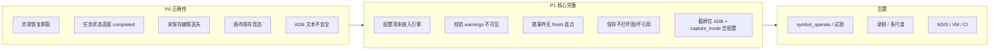
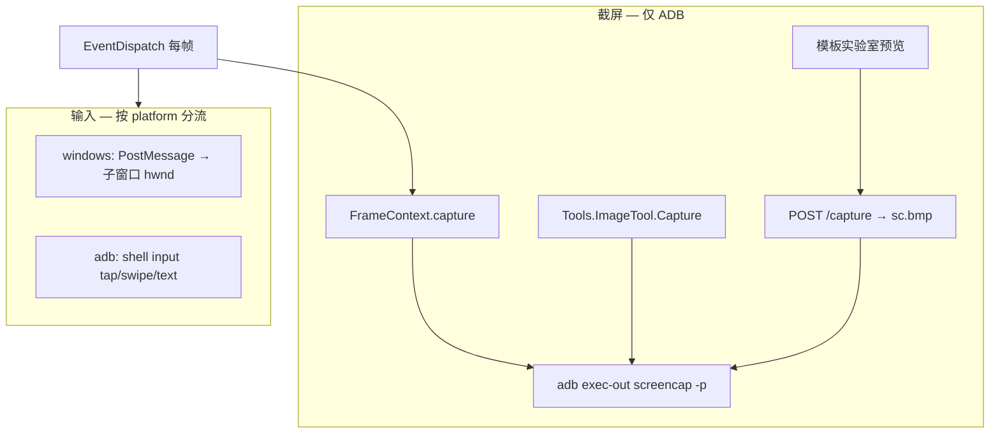
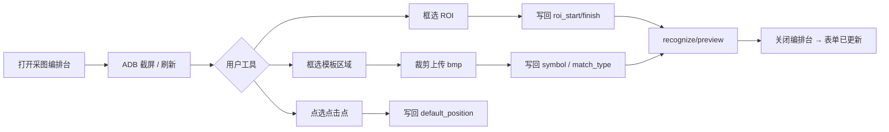

# Freer 升级计划 V2

> **定位**：在 [UPGRADE_PLAN.md](./UPGRADE_PLAN.md)（V0.4 架构与 Phase 0–3.5 历史）基础上，基于 **2025-06 全栈审查** 制定的**执行向**路线图。  
> **原则**：优先排期**核心功能**——引擎行为可信、任务状态诚实、编排可保存可校验；增强能力与打包 polish 后置。  
> **基线**：工作区 **V0.4.0**；Phase 0–3.5 已落地；识别流水线 GUI、动作契约 A+B 已完成。

---

## 一、审查结论摘要

### 1.1 已足够支撑日常使用的部分

| 领域 | 状态 |
|------|------|
| 多 Matcher 识别 + L1/L2 fallback | 引擎可用；流水线 GUI 已落地 |
| 动作 `platform` + `steps` + 指针会话 | 引擎 + GUI + 联合校验 |
| 事件库三栏/画布编排、DnD、环检测标红 | 主流程可完成 |
| 任务 start/pause/resume/stop、WS 日志 | API 与 UI 已通 |
| 模板/ROI 实验室、导入导出、便携包 | 可用（实验室与事件编辑仍割裂） |

### 1.2 阻碍「核心功能可信」的缺口（必须优先）



### 1.3 审查详情（按领域，2025-06）

> 本节为对话审查的**完整归档**；第二节编号与之对应，第三至八节为排期。

#### 1.3.1 截屏与输入通道（重要架构缺口）

Freer 在 Windows 上跑，但**截屏与点击走不同通道**，且截屏**只有 ADB 一条路**：



| 事实 | 代码位置 | 说明 |
|------|----------|------|
| **无 Win32 窗口截图** | 全库无 `PrintWindow`/`BitBlt`/`mss` | 不能按 `window_name` 直接抓模拟器子窗口位图 |
| **无本地屏幕截图** | 同上 | 与「Windows 平台自动化」文档印象不一致 |
| **`capture_mode` 未接入** | `config.yaml` 有 `adb_pipe`；`FrameContext.capture` **硬编码** `AdbClient.screencap()` | 设置页可改，**引擎忽略**（V2-P1-14） |
| **识别坐标系** | ADB 截图像素 = 设备分辨率 | Win32 点击坐标 = 子窗口客户区；依赖模拟器 1:1 映射，**无校准层** |
| **暂停调试截图未实现** | §4.3.9 L3、`on_task_pause` 仅在 config/API 暴露 | 与「只有 ADB 截图」无关，属于配置未接线（V2-P1-1） |
| **legacy 读文件** | `Tools.ImageTool.FindImage` 读 `sc.bmp` | 主路径已走 `recognition/`，旧路径仍 ADB 写入文件 |

**结论**：当前是 **「ADB 截图 + Win32/ADB 点击」混合架构**；V2 **不排 Win32 抓窗**（无此实现计划），但必须在 5C 中：**写清文档、修好 `capture_mode` 语义（实现或 UI 禁用）、ADB 失败时任务状态诚实（5A-2）**。

#### 1.3.2 引擎与调度

| 问题 | 严重度 | 说明 |
|------|--------|------|
| 异常微事件不恢复 `inactive_list` | P0 | `RecoverExceptionEvent` 仅 `event_type==0` |
| 任务暂停/失败报 `completed` | P0 | `EventDispatch` 正常返回 + `task_runner` 未区分原因 |
| 无 `symbol_finish` 微事件每帧重试 | P1 | 起始标志仍在屏则不出栈，循环 `DoMicroEvent` |
| `ColdEventCape` `run_time` 无下界 | P1 | 可负值 |
| pause/stop 非即时 | P1 | 仅帧边界；`sleep`/步骤内不检查 |
| 空 `position` 静默 no-op | P1 | 只 print，不写结构化日志 |
| `default_position` 格式分裂 | P1 | 微事件路径 vs `position_utils` 不一致 |
| 坏引用进栈 | P1 | `InitEventTree` 可返回 `None` |
| `last_known` 任意 pop 全清 | P2 | `_pop_event` 清空整个 cache |
| 大量 `print` 未进 `freer_log` | P2 | WS 日志流不完整 |
| `type(x).__name__` 判类型 | 低 | 技术债 |

#### 1.3.3 识别层

| 问题 | 严重度 | 说明 |
|------|--------|------|
| `max_consecutive_miss_frames` 等未读 | P1 | 设置无效 |
| `UiMatcher` 忽略 ROI | P1 | 与 §4.3.3「ROI 优先」矛盾 |
| `FeatureMatcher` 仅用第一个 `\|` 模板 | P1 | 多模板静默丢弃 |
| OCR 降频帧返回 `[]` | P2 | 可能闪烁 miss/hit |
| `router.select_by_index` 未使用 | 低 | 死代码 |
| fallback 非 MATCH_TYPES 条目 | P2 | 运行时静默失败，validate 未拦 |

#### 1.3.4 API / 持久化 / 校验

| 问题 | 严重度 | 说明 |
|------|--------|------|
| `EventStore` 写入不强制 validate | P1 | 坏配置可入库 |
| 保存忽略 `warnings` | P1 | 缺模板、契约警告不可见 |
| 多模板路径跳过 `missing_template` | P1 | `symbol` 含 `\|` 时不逐段校验 |
| 仅校验单事件，非整树 | P1 | 改父宏子列表后子节点问题漏检 |
| `EventStore.list_events` 未 sanitize | P2 | 动作侧有 sanitize，事件侧无 |
| `GET /events/{name}/tree` 等未用 | P2 | GUI 自建树，无服务端 parity |

#### 1.3.5 GUI 与 Tauri

| 问题 | 严重度 | 说明 |
|------|--------|------|
| 切换事件丢未保存 draft | P0 | `selectFromSidebar` 无脏检查 |
| 画布 patch 保存竞态 | P0 | `saveAllPatches` 无 await |
| 宏↔微切换不清理字段 | P1 | orphan `event_list`/`action` |
| 画布点空白仍显示旧属性面板 | P1 | `selectedNodeId(null)` 不关闭 panel |
| 起/止共用 `accuracy` | P1 | 结束流水线误改起始阈值 |
| 流水线无内联 preview | P1 | 须去实验室重填参数 |
| 无 `index_start`/`index_finish` | P1 | 引擎支持，GUI 无 |
| 删除无确认/引用检查 | P1 | 事件、动作均有 |
| 动作无 Zod、不可重命名 | P1 | `actionSchema` 未用 |
| 任务 API 错误无 toast | P1 | start/pause/stop |
| 实验室仅 preview `kind:start` | P1 | 无法调结束标志 |
| 实验室不能上传模板 | P1 | 须回事件表单 |
| 设置 `capture_mode`/`log_level` 自由文本 | P1 | 易配错且 capture 无效 |
| import replace 无二次确认 | P1 | 可一键覆盖全部数据 |
| `TaskPage` WS 常连 | P2 | `useLogWebSocket(isActive \|\| true)` |
| Sidecar 仅 HTTP health | P2 | `sidecar_status`/spawn 失败未进 UI |
| 关窗 `kill` 非 `/shutdown` | P2 | 可能 mid-write |
| Zod schemas 全局未用 | P2 | 仅 server validate 于事件保存 |
| §4.4.8.2 目录拖入 | 已实现 | 计划条目过时 |
| 环检测 | 部分 | 标红但未禁用 Save |
| **全局单列表，无项目边界** | **P1** | 多脚本混在 `event.json`；无项目切换 UI |
| **采图与建事件割裂** | **P1** | 模板/ROI 在独立页；创建时不能从画面选点写回 |

#### 1.3.6 产品化缺口（用户反馈，2025-06 补充）

**缺口 A — 项目管理与事件目录**

| 现状 | 痛点 |
|------|------|
| `data/event.json` 单文件扁平列表 | 多游戏/多脚本混一起，难维护 |
| `EventsPage` 仅搜索框过滤 | 宏/微/异常只靠 `event_type` 与图标，**无分组 Tab** |
| `config.data_dir` 可换目录 | 无 GUI「项目」概念，需手改配置 |

**缺口 B — 建事件时的采图编排**

| 现状 | 痛点 |
|------|------|
| `TemplateLabPage` 独立路由 | 与事件编辑上下文断裂 |
| 事件表单手填路径 / 选模板 | 无「当前画面 → 框选 → 生成 .bmp → 写入 symbol」 |
| ROI 拖拽仅在实验室 | `RecognitionPipelinePanel` 只能手输坐标 |
| 实验室仅 `kind:start` | 结束标志、流水线内无法采图 |

详见 **§七 Phase 5F / §八 Phase 5G** 设计方案。

#### 1.3.7 模型能力（原 §4.7 C/D，均未实现）

| 能力 | 说明 |
|------|------|
| `symbol_operate` | 触发区与操作区分离 |
| `dwell_seconds` / 内置等待微事件 | 无空动作等待 |
| `dry-run` | 无试跑 API/GUI |
| `default_action_platform` | 新建动作恒为 windows |
| mac `platform` | 可配，`MacAction` 全 unsupported |
| Windows `text` 步骤 | 仍走 ADB 逐字符 |

#### 1.3.8 测试覆盖缺口

| 区域 | 已有 | 缺失 |
|------|------|------|
| 调度整链 | phase0/1 片段 | `EventDispatch`、异常流、`max_rotate_time`、微事件连点 |
| 任务状态机 | phase3 仅 pause 409 | 线程级 pause/resume/stop、`TaskPausedError`→status |
| freer_api HTTP | phase3 部分 | 任务生命周期 CRUD 冲突、WS logs |
| 识别 matcher | phase15 单元 | 真实图像、Ui/Color/Feature 集成 |
| capture | phase1 screencap 失败 | **无 capture_mode 分支测试**（因未实现） |
| GUI | 无 | 全流程无自动化 |


## 二、问题清单（V2 编号）

### 2.1 P0 — 不修则核心流程不可信

| ID | 问题 | 位置 | 用户影响 |
|----|------|------|----------|
| **V2-P0-1** | 异常**微事件**完成后不恢复 `inactive_list` | `Control.RecoverExceptionEvent` 仅 `event_type==0` | 弹窗处理后子事件队列永久缺失 |
| **V2-P0-2** | `TaskPausedError`/截图失败等返回后状态为 **`completed`** | `task_runner` + `EventDispatch` | 任务页显示「完成」而非错误/暂停 |
| **V2-P0-3** | 左侧切换事件无脏检查，**静默丢弃 draft** | `EventsPage.selectFromSidebar` | 编排丢失 |
| **V2-P0-4** | 画布 `saveAllPatches` 未 `await`，嵌套节点编辑易丢 | `EventGraphEditor` | 多宏保存不一致 |
| **V2-P0-5** | ADB `input text` 无转义，按字符 shell 注入 | `adb_client` / `AdbAction` | 文本步骤失败或安全风险 |

### 2.2 P1 — 核心体验与引擎一致性

| ID | 问题 | 位置 | 用户影响 |
|----|------|------|----------|
| **V2-P1-1** | `max_consecutive_miss_frames`、`on_task_pause`、可配 `last_known_ttl` **未接入调度** | `config` vs `Control`/`router` | 设置页改配置无效 |
| **V2-P1-2** | 保存只拦 `issues`，**`warnings` 不展示**；仅校验单事件 | `EventsPage` save + `validate.py` | 缺模板/契约警告仍保存 |
| **V2-P1-3** | 无 `symbol_finish` 时起始标志仍在屏 → **每帧重试微事件** | `EventIsFinish` / `DoMicroEvent` | 常驻 UI 连点 |
| **V2-P1-4** | `ColdEventCape` 的 `run_time` 无下界 | `Control.ColdEventCape` | 冷却逻辑失真 |
| **V2-P1-5** | pause/stop 只在帧边界；步骤 `sleep` 不响应 | `execute_step` / `DoGrandEvent` | 暂停/停止延迟数秒 |
| **V2-P1-6** | 空 `position` 静默 no-op | `DoMicroEvent` | 识别失败难排查 |
| **V2-P1-7** | `default_position` 扁平静态数组在微事件路径未统一 | `DoMicroEvent` vs `position_utils` | 部分坐标格式不生效 |
| **V2-P1-8** | 坏子事件引用可进栈，运行时才崩 | `InitEventTree` + `validate` | 应用层应 fail-fast |
| **V2-P1-9** | 删除事件/动作无确认、无引用检查 | GUI 各页 | 悬空引用 |
| **V2-P1-10** | 起/止标志共用 `event.accuracy` | `RecognitionPipelinePanel` | 结束阈值误改起始 |
| **V2-P1-11** | 任务 start 无预检；mutation 错误无 UI | `TaskPage` | 坏树跑起来才发现 |
| **V2-P1-12** | 动作页无校验；不可重命名 | `ActionsPage` | 坏动作入库 |
| **V2-P1-13** | 识别流水线无内联 preview；缺 `index_*` | GUI | 调参效率低 |
| **V2-P1-14** | **`capture_mode` 未接入；全链路仅 ADB 截屏** | `config` vs `FrameContext`/`Tools.ImageTool` | 设置误导；无 Win32 抓窗；与 Win32 点击坐标系无文档 |
| **V2-P1-15** | 多模板路径不校验 `missing_template` | `validate.py` | `\|` 分隔 symbol 跳过资源检查 |
| **V2-P1-16** | 宏↔微切换不清理字段 | `EventPropertyForm` | draft 残留无效字段 |
| **V2-P1-17** | 实验室仅 `kind:start`、不能上传模板 | `TemplateLabPage` | 结束标志调试与事件编辑割裂 |
| **V2-P1-18** | `UiMatcher` 忽略 ROI | `matchers/ui.py` | 全屏 UI 查询易误匹配 |
| **V2-P1-19** | `EventStore` 保存不 validate；list 未 sanitize | `freer_api/store.py` | 坏数据入库/回显 |
| **V2-P1-20** | **无项目维度；事件全局扁平列表** | `event.json`, `EventsPage` | 多脚本混杂；无法按项目导出/运行 |
| **V2-P1-21** | **采图能力孤立在模板实验室** | `TemplateLabPage` vs `EventPropertyForm` | 建事件无法从画面选点/裁模板/写回 |
| **V2-P1-22** | 任务/设置/导出未绑定「当前项目」 | `TaskPage`, `SettingsPage` | 换项目需手改 `data_dir` |

### 2.3 P2 — 增强与 polish（V2 排期靠后）

| ID | 摘要 | 关联 |
|----|------|------|
| V2-P2-1 | `symbol_operate` 触发/操作分离 | §4.7 C1 |
| V2-P2-2 | `dwell_seconds` / 内置等待微事件 | §4.7 C3 |
| V2-P2-3 | `POST /actions/{name}/dry-run` + GUI | §4.7 C4 |
| V2-P2-4 | `default_action_platform` | §4.7 C2 |
| V2-P2-5 | mac 平台：GUI 禁用或实现 `MacAction` | §4.7 D1 |
| V2-P2-6 | Windows `text` 仍走 ADB；应 Win32 或强警告 | §4.7 A3/D |
| V2-P2-7 | Feature 多模板、OCR 降频闪烁、`select_by_index` 死代码 | 识别质量 |
| V2-P2-8 | NSIS、VM 验收、OpenAPI CI workflow | Phase 3 打包 |
| V2-P2-9 | 录制、多尺度、插件 Matcher | Phase 4 |
| V2-P2-10 | `last_known` 任意 pop 全清 | `Control._pop_event` |
| V2-P2-11 | 执行失败仍 `print`，WS 日志不全 | `freer_log` |
| V2-P2-12 | 设置 import replace 无确认；导出不可选子集 | `SettingsPage` |
| V2-P2-13 | Sidecar spawn 错误、`/shutdown`、Tauri `sidecar_status` | `src-tauri` |
| V2-P2-14 | 画布点空白属性面板残留；图/经典切换丢面包屑 | `EventGraphEditor` |
| V2-P2-15 | **Win32 窗口截图**（`PrintWindow` 等） | **不在 V2 排期**；若 ADB 截屏不足再单独立项 |

### 2.4 输入/截屏通道对照（审查结论表）

| 能力 | windows 平台动作 | adb 平台动作 | 截屏（识别） |
|------|------------------|--------------|--------------|
| 实现 | `PostMessage` → hwnd | `adb shell input` | **仅** `adb screencap` |
| 坐标系 | 子窗口客户区 | 设备像素 | 设备像素（ADB） |
| 配置项 | `window_name` | `adb_device` | `capture_mode`（**无效**） |
| GUI 暴露 | 事件窗口名、动作 platform | 同左 + 设置 ADB | 设置 capture_mode（**误导**） |
| V2 处理 | 保持 | 保持 | **5C-8**：文档 + 实现或禁用配置 |

---

## 三、V2 阶段路线图（核心优先）

### 总览

| 阶段 | 版本 | 主题 | 目标 |
|------|------|------|------|
| **5A** | V0.4.3 | 引擎可信 | 调度/任务状态/异常恢复/安全输入 |
| **5B** | V0.4.4 | 编排可信 | 脏检查、校验闭环、画布保存、删除护栏 |
| **5C** | V0.4.5 | 配置生效 | 设置项接入引擎；微事件执行语义收紧 |
| **5F** | V0.5.0 | **项目与目录** | 多项目隔离；宏/微/异常分类；任务绑定项目 |
| **5G** | V0.5.1 | **采图编排台** | 建事件时从画面选点、裁模板、写回识别字段 |
| **5D** | V0.5.2 | 模型增强 | `symbol_operate`、等待微事件、试跑 |
| **5E** | V0.5.x | 产品发布 | 安装包、CI、识别/GUI polish |
| **6+** | — | 按需 | Phase 4 录制、多尺度、mac 执行器等 |

```text
现在 ──► 5A ──► 5B ──► 5C ──► 5F ──► 5G ──► 5D ──► 5E ──► Phase 4
              引擎   编排   配置   项目   采图   模型   发布

说明：5F/5G 为「核心创作体验」，排在 5D 模型增强之前（用户反馈优先）。
      5G 依赖 5C-8（截屏通道诚实化）与 5F（项目级 img/ 目录）。
```

---

## 四、Phase 5A — 引擎可信（V0.4.3）

**里程碑 M-A**：任务失败不再显示「完成」；异常处理后子队列可恢复；文本输入不因特殊字符炸 shell。

### 任务

| 任务 | 修复 ID | 关键文件 | 说明 |
|------|---------|----------|------|
| **5A-1 异常恢复** | P0-1 | `Control.py` | `RecoverExceptionEvent` 支持 `is_exception` 微事件；或统一异常完成回调 |
| **5A-2 任务状态机** | P0-2 | `Control.py`, `task_runner.py` | `EventEx` 暴露结束原因（completed / stopped / paused / error）；`TaskPausedError` → `error` 或 `paused` |
| **5A-3 ADB 文本安全** | P0-5 | `recognition/adb_client.py`, `Tools.py` | 转义或 `KEYCODE` 映射；`validate` 告警非法字符 |
| **5A-4 引用 fail-fast** | P1-8 | `validate.py`, `InitEventTree` | 缺失子事件/动作升为 `issues`；构建树前可选硬失败 |
| **5A-5 冷却与空坐标** | P1-4, P1-6 | `Control.py` | `run_time` 下限 0；空 position 记 `freer_log` 并跳过（可配置为 error） |
| **5A-6 default_position 统一** | P1-7 | `DoMicroEvent`, `position_utils` | 微事件坐标解析复用 `default_position_to_rects` |

### 验收标准

- [ ] 异常微事件执行后，父宏 `inactive_list` 中子项回到可调度状态（集成测试）
- [ ] 窗口缺失 / ADB 失败 / `last_resort=pause` 后 `GET /task/status` ≠ `completed`
- [ ] 含空格与 `%` 的 `text` 步骤在雷电 ADB 上可预期成功或明确失败
- [ ] `validate_events` 对悬空 `event` 引用返回 `valid: false`

### 建议 PR

1. `fix-exception-inactive-recovery`（5A-1）
2. `fix-task-terminal-status`（5A-2）
3. `fix-adb-text-escape`（5A-3）
4. `engine-hardening-cold-position`（5A-4–6）

---

## 五、Phase 5B — 编排可信（V0.4.4）

**里程碑 M-B**：用户在 GUI 完成的编排**不会无声丢失**；保存结果与校验一致；破坏性操作有确认。

### 任务

| 任务 | 修复 ID | 关键文件 | 说明 |
|------|---------|----------|------|
| **5B-1 脏检查** | P0-3 | `EventsPage.tsx` | 切换目录/模式前对比 draft vs server；确认对话框 |
| **5B-2 画布保存** | P0-4 | `EventGraphEditor.tsx` | `saveAllPatches` 顺序 await；面板未保存提示；切节点拦截 |
| **5B-3 校验闭环** | P1-2 | `EventsPage`, `validate` API | 展示 `warnings`；保存宏时校验子树引用；可选「严格保存」 |
| **5B-4 删除护栏** | P1-9 | `EventsPage`, `ActionsPage`, `validate` | 确认框 + `missing_event_ref` 反向引用检查 |
| **5B-5 环检测联动** | — | `EventsPage`, `CompositionTreeView` | 存在 cycle 时禁用 Save 并说明 |
| **5B-6 动作校验与重命名** | P1-12 | `ActionsPage`, `actionSchema` | 保存前 Zod；`PUT` 支持改名或显式「另存为」 |
| **5B-7 任务预检** | P1-11 | `TaskPage.tsx` | Start 前 `validate` 根宏；API 错误 toast |
| **5B-8 表单与实验室** | P1-16, P1-17 | `EventPropertyForm`, `TemplateLabPage` | 宏微切换清理；实验室 finish 预览 + 上传模板 |
| **5B-9 设置项护栏** | P1-14, P2-12 | `SettingsPage` | `capture_mode`/`log_level` 枚举或只读说明；import replace 确认 |

### 验收标准

- [ ] 有未保存修改时切换左侧事件，必须确认或取消
- [ ] 画布模式编辑子宏 → 保存 → 刷新后字段一致
- [ ] 保存时 warnings 面板可见；缺模板路径有黄色提示
- [ ] 删除被引用事件时阻止或二次确认并列出引用方
- [ ] 任务启动失败在 UI 有明确错误文案

### 建议 PR

1. `gui-unsaved-guard`（5B-1）
2. `gui-graph-save-reliability`（5B-2）
3. `gui-validate-warnings-delete`（5B-3–5）
4. `gui-actions-task-preflight`（5B-6–7）

---

## 六、Phase 5C — 配置生效与执行语义（V0.4.5）

**里程碑 M-C**：设置页与 `config.yaml` 改动**真实影响引擎**；微事件「触发后行为」可预期。

### 任务

| 任务 | 修复 ID | 关键文件 | 说明 |
|------|---------|----------|------|
| **5C-1 连续未命中暂停** | P1-1 | `Control.EventDispatch`, `config` | 计数 `max_consecutive_miss_frames`；触发暂停 + `freer_log` |
| **5C-2 暂停时调试截图** | P1-1 | `config`, `FrameContext` | `on_task_pause: save_screenshot` → `logs/debug/` |
| **5C-3 last_known TTL** | P1-1 | `router`, `LastKnownCache` | 读 `recognition.last_known_ttl_frames` |
| **5C-4 可中断等待** | P1-5 | `ActionEx.execute_step`, `DoGrandEvent` | `sleep` 切片检查 pause/stop |
| **5C-5 微事件重入策略** | P1-3 | `Control`, 文档 | 产品决策二选一：**A)** 文档明确须配 `symbol_finish`；**B)** 新增 `fire_once` 或默认「入栈后仅执行一次直到完成」 |
| **5C-6 识别表单修正** | P1-10, P1-13 | `RecognitionPipelinePanel`, models | `accuracy_start`/`accuracy_finish`；`index_*`；内联 preview |
| **5C-7 识别配置接线** | P1-1, P1-18 | `Control`, `router`, `validate` | `max_consecutive_miss_frames`、`last_known_ttl`；UiMatcher ROI 或文档限制 |
| **5C-8 截屏通道诚实化** | P1-14 | `frame.py`, `config`, `README`, GUI | 见下表 |
| **5C-9 校验与存储** | P1-15, P1-19 | `validate.py`, `store.py` | 多模板资源检查；可选保存前 validate；list sanitize |

**5C-8 截屏通道（明确范围）**

| 子项 | 做 | 不做（V2） |
|------|-----|------------|
| 文档 | README/设置页写明：**识别截屏仅 ADB**；Win32 只负责点击；坐标假设 1:1 | — |
| `capture_mode` | **方案 A（推荐）**：仅保留 `adb_pipe` 并只读/隐藏设置项，删除误导 **或** **方案 B**：预留枚举，第二种模式标 `planned` | **Win32 窗口 BitBlt/PrintWindow 截图** |
| 代码 | `FrameContext.capture` 读 `config.capture_mode`；非支持值告警回退 ADB | 本地屏摄、mss、DXGI |
| 失败 | ADB 截屏失败 → `TaskPausedError` + 5A-2 状态非 completed | — |
| 调试 | `on_task_pause: save_screenshot` 保存**当前 ADB 帧**到 `logs/debug/` | 非 Win32 抓窗 |

### 验收标准

- [ ] 连续 N 帧全局无命中后任务自动 paused（可配置 N）
- [ ] 暂停时生成调试截图（配置开启时，**内容为 ADB 帧**）
- [ ] 暂停请求在 ≤1s 内生效（普通 wait 步骤）
- [ ] 起始/结束可使用不同 accuracy；GUI 可设 `index_start`
- [ ] 流水线面板一键 preview 当前步 ROI/匹配结果
- [ ] **用户读 README/设置可知：截屏=ADB，无 Win32 截图；`capture_mode` 不再误导**
- [ ] 多模板 `symbol` 缺图时 validate 出 warning

### 建议 PR

1. `engine-recognition-safeguards`（5C-1–3, 5C-7）
2. `engine-interruptible-wait`（5C-4）
3. `engine-micro-fire-semantics`（5C-5，含文档）
4. `gui-pipeline-preview-index`（5C-6）
5. `capture-channel-honesty`（5C-8：文档 + capture_mode + 暂停存图）
6. `validate-store-hardening`（5C-9）

---

## 七、Phase 5F — 项目与目录（V0.5.0）

**里程碑 M-F**：多脚本/多游戏**数据隔离**；事件库**可浏览、可筛选**；任务与导出绑定当前项目。

> 修复 **V2-P1-20、P1-22**。排在 5G 之前：采图编排台需要项目级 `img/` 与事件命名空间。

### 7.1 设计目标

| 目标 | 说明 |
|------|------|
| **项目 = 工作区** | 每个项目独立 `event.json`、`action.json`、`img/`、可选 `project.yaml` |
| **单项目内分类** | 左侧目录至少：**全部 / 宏事件 / 微事件 / 异常**（`event_type` + `is_exception`） |
| **全局不混杂** | UI 顶栏或侧栏切换「当前项目」；引擎/API 只读写当前项目路径 |
| **向后兼容** | 现有 `data/` 迁移为默认项目 `default` 或 `主项目`，用户无感升级 |

### 7.2 目录与数据模型

**工作区根目录**（`PROJECT_ROOT` 或用户可选 workspace 路径）：

```text
freer/
├── workspace.yaml              # 工作区索引（新建）
├── projects/
│   ├── default/                # 迁移自现有 data/
│   │   ├── project.yaml        # 元数据
│   │   ├── event.json
│   │   ├── action.json
│   │   ├── count.json
│   │   └── img/                # 项目专属模板（原 img/ 可迁入或软链）
│   └── maple-bot/
│       ├── project.yaml
│       ├── event.json
│       └── ...
├── config.yaml                 # 全局：adb、api；active_project_id
└── ...
```

**`project.yaml` 示例**：

```yaml
id: maple-bot
name: 枫之谷日常
description: 日常讨伐与签到
default_root_event: 主流程        # 任务页默认根宏（可选）
created_at: 2025-06-16
tags: [game, daily]
```

**事件条目**（可选扩展字段，向后兼容）：

```json
{
  "name": "点击讨伐",
  "event_type": 1,
  "project_id": "maple-bot",
  "tags": ["战斗"],
  ...
}
```

`project_id` 可省略（隐含当前项目文件）；跨项目引用 **禁止**，validate 报错。

### 7.3 API 设计（OpenAPI v1.2 增量）

| 方法 | 路径 | 说明 |
|------|------|------|
| GET | `/projects` | 列出项目 |
| POST | `/projects` | 新建（空 event/action + img 目录） |
| GET | `/projects/{id}` | 元数据 + 统计（宏/微/异常数量） |
| PUT | `/projects/{id}` | 改名、默认根事件等 |
| DELETE | `/projects/{id}` | 删除（需无运行中任务 + 确认） |
| POST | `/projects/{id}/activate` | 切换当前项目（刷新 `paths`） |
| GET/POST/... | `/events` 等 | **语义不变**，作用域 = 当前激活项目 |

引擎：`paths.refresh_paths()` 扩展为 `active_project → DATA_DIR / IMG_DIR`。

### 7.4 GUI 信息架构

```text
┌──────────────────────────────────────────────────────────┐
│ [项目 ▼ 枫之谷日常]  │  事件库  │  动作  │  任务  │ 设置  │
├─────────────┬────────────────────────────────────────────┤
│ ＋ 新建项目   │  Tab: [全部][宏][微][异常]  🔍 搜索        │
│ ─────────── │  ─────────────────────────────────────     │
│ ● 枫之谷日常  │  宏 › 主流程                              │
│   测试用例    │  微 › 点击讨伐 · 输入密码                  │
│              │  微 › 关闭弹窗 (异常)                       │
└─────────────┴────────────────────────────────────────────┘
```

| 改动 | 文件 |
|------|------|
| 项目切换器 + 新建/删除项目 | `Layout.tsx` 或 `ProjectSwitcher.tsx` |
| 宏/微/异常 Tab + 分组列表 | `EventsPage.tsx` |
| 任务页根事件列表 | 仅当前项目事件 |
| 导出/导入 | 默认**当前项目** zip；设置页可「导入为新项目」 |
| 设置页 | `data_dir` 改为高级项；主流程用项目管理 |

### 7.5 迁移策略

1. 首次启动 v0.5.0：若存在 `data/event.json` 且无 `workspace.yaml` → 创建 `projects/default/` 并移动/复制数据。
2. `config.yaml` 增加 `active_project: default`。
3. 旧 `img/` 根目录：模板路径 `../img/foo.bmp` 解析规则 → 优先 **当前项目 `img/`**，再回退全局 `img/`（过渡期）。

### 7.6 任务与验收

| 任务 | 说明 |
|------|------|
| **5F-1 workspace 与 paths** | `workspace.yaml`、`projects/*`、`paths.active_project` |
| **5F-2 projects API** | CRUD + activate |
| **5F-3 store 作用域** | `EventStore`/`ActionStore` 读写当前项目 |
| **5F-4 迁移脚本** | `data/` → `projects/default/` 一次性 |
| **5F-5 GUI 项目切换器** | 顶栏下拉 + 新建向导 |
| **5F-6 事件目录 Tab** | 宏/微/异常筛选；列表显示类型徽章 |
| **5F-7 任务/导出绑定** | `TaskPage`、`export_import` 按项目 |
| **5F-8 validate** | 禁止跨项目引用；删除项目前检查引用 |

### 验收标准

- [ ] 可创建 ≥2 个项目，切换后事件/动作/模板互不可见
- [ ] 单项目内可按宏/微/异常 Tab 筛选，与 `event_type`/`is_exception` 一致
- [ ] 任务运行使用当前项目 `event.json`；切换项目时任务已停止
- [ ] 导出 zip 仅含当前项目事件、动作、关联 `img/`
- [ ] 从 V0.4 `data/` 升级后默认项目数据完整

### 建议 PR

1. `projects-workspace-paths`（5F-1–4）
2. `projects-api`（5F-2–3）
3. `gui-project-switcher-catalog`（5F-5–6）
4. `projects-task-export`（5F-7–8）

---

## 八、Phase 5G — 采图编排台（V0.5.1）

**里程碑 M-G**：在**创建/编辑事件**时完成「截屏 → 框选 → 裁模板 / ROI / 坐标 → 预览 → 写回字段」，不再依赖独立模板页。

> 修复 **V2-P1-21**；合并并超越现有 `TemplateLabPage`。依赖 **5C-8**（ADB 截屏语义清晰）、**5F**（项目 `img/` 落盘路径）。

### 8.1 设计目标

| 目标 | 说明 |
|------|------|
| **上下文内采图** | 在 `EventPropertyForm` / 流水线面板内打开编排台，带着当前 `window_name`、识别字段 |
| **一体化工具** | 一张画布上：截屏、拖 ROI、裁模板、点选坐标、识别预览 |
| **写回明确** | 用户点「设为起始模板」等按钮，直接改 `symbol_start` / `roi_start` / `default_position` |
| **实验室降级** | `TemplateLabPage` 保留为「高级调试」或并入编排台「全屏模式」 |

### 8.2 交互流程



**工具栏（画布左侧或顶部）**：

| 工具 | 手势 | 写回字段 |
|------|------|----------|
| 截取刷新 | 按钮 | 更新画布位图（`POST /capture`） |
| ROI 矩形 | 拖拽 | `roi_start` / `roi_finish`（由当前编辑的流水线步骤决定） |
| 模板区域 | 拖拽 | 裁剪 → `POST /templates/crop` → `symbol_*` 路径 |
| 点击点 | 单击 | `default_position` 小矩形（可配置半边长） |
| 识别预览 | 按钮 | `POST /recognize/preview`，叠加命中框 |
| 追加模板 | 按钮 | `\|` 追加多模板到 `symbol_start` |

### 8.3 API 增量（v1.2）

| 方法 | 路径 | 说明 |
|------|------|------|
| POST | `/templates/crop` | body: `{ image: "capture"\|base64, rect: [x1,y1,x2,y2], name? }` → 保存到**当前项目** `img/`，返回相对路径 |
| POST | `/capture` | 已有；返回 url + 宽高（扩展 `width`/`height` 供画布缩放） |
| POST | `/recognize/preview` | 已有；编排台传入当前表单草稿字段 |

裁剪实现：服务端 OpenCV 裁切 ADB 帧或上次 `sc.bmp`，写入 `projects/{id}/img/{auto-name}.bmp`。

### 8.4 组件结构

```text
gui/src/components/capture/
├── CaptureWorkbench.tsx      # 全屏 Dialog / 分栏嵌入
├── CaptureCanvas.tsx         # 缩放、平移、叠加层
├── CaptureToolbar.tsx        # 工具切换
├── useCaptureSession.ts      # 截屏 URL、设备分辨率、坐标换算
└── applyCaptureResult.ts     # 写回 FreerEvent 纯函数（可单测）
```

**嵌入点**：

| 入口 | 行为 |
|------|------|
| `RecognitionPipelinePanel` | 每步「从画面选取…」→ 打开 Workbench，`targetField` = start/finish + step |
| `EventsPage` 新建微事件 | 向导 Step2：采图编排台（可选跳过） |
| `EventPropertyForm` `default_position` | 「从画面选点」 |
| `TemplateLabPage` | 重定向到 Workbench 全屏或共享 `CaptureCanvas` |

### 8.5 坐标与通道（对齐 §1.3.1）

- 画布坐标 = **ADB 截图像素**（设备分辨率），与识别、ROI、`default_position` 一致。
- Win32 点击仍用 `window_name`；编排台显示提示：「识别基于 ADB 画面，请保持模拟器分辨率稳定」。
- 缩略图裁剪保存为 `.bmp`，与现有 `TemplateMatcher` 一致。

### 8.6 任务与验收

| 任务 | 说明 |
|------|------|
| **5G-1 `/templates/crop`** | 服务端裁切 + 项目 `img/` 写入 |
| **5G-2 CaptureCanvas** | 拖拽 ROI/模板框、点选；设备坐标 |
| **5G-3 CaptureWorkbench** | 工具栏 + 写回回调 |
| **5G-4 嵌入流水线** | `RecognitionPipelinePanel` 入口；支持 start/finish |
| **5G-5 新建事件向导** | 微事件创建可选「从画面配置起始标志」 |
| **5G-6 预览叠加** | 同实验室命中框，但不离开事件页 |
| **5G-7 实验室收敛** | 复用组件或标为「打开编排台」 |

### 验收标准

- [ ] 新建微事件：截屏 → 框模板 → 保存后 `symbol_start` 指向项目 `img/` 下新文件
- [ ] 同流程可设 `roi_start` 且 preview 命中与实验室一致
- [ ] 可从画面点选写回 `default_position`，任务可点击该位置
- [ ] 多模板：连续裁两块 → `symbol_start` 为 `path1|path2`
- [ ] 全程无需打开独立「模板/ROI」页即可完成常用配置

### 建议 PR

1. `api-template-crop`（5G-1）
2. `gui-capture-canvas`（5G-2–3）
3. `gui-workbench-pipeline-embed`（5G-4–6）
4. `template-lab-converge`（5G-7）

---

## 九、Phase 5D — 模型增强（V0.5.2）

**里程碑 M-D**：表达力补齐——不破坏 V0.4 已有 JSON 的向后兼容。

### 任务

| 任务 | 原规划 | 说明 |
|------|--------|------|
| **5D-1 symbol_operate** | C1 | 微事件可选操作区域，默认同 `symbol_start` |
| **5D-2 纯等待微事件** | C3 | `dwell_seconds` 或 `_builtin/wait`；宏事件可直接调度 |
| **5D-3 动作试跑** | C4 | `POST /actions/{name}/dry-run` + 任务页/动作页按钮 |
| **5D-4 默认 platform** | C2 | `config.default_action_platform` + 新建动作继承 |
| **5D-5 校验扩展** | — | `symbol_operate` 与动作位置联合校验 |

### 验收标准

- [ ] 「A 图触发、B 区域点击」无需拆两个微事件 workaround
- [ ] 无动作名的等待节点可插入宏队列
- [ ] dry-run 使用当前 preview 坐标，不推进任务栈

### 依赖

- **5A–5C 完成后再改事件 schema**，避免与修复 PR 冲突。

---

## 十、Phase 5E — 产品发布（V0.5.x，与 5D 可部分并行）

| 任务 | 说明 | 优先级 |
|------|------|--------|
| NSIS 安装包 + 干净 VM 验收 | `package.mjs installer` | 中 |
| OpenAPI CI workflow | 根 `package.json` + GitHub Actions | 中 |
| Sidecar 优雅退出 | 关窗调 `POST /shutdown` | 低 |
| README deprecated / 前置依赖 | PySide 已移除说明 | 低 |
| 选择性导出、实验室 finish 预览 | P2 polish | 低 |

**原则**：不阻塞 5A–5D；可在 5B 完成后启动 VM 验收。

---

## 十一、Phase 6+ — 按需（原 Phase 4 / §4.7 D）

| 能力 | 优先级 | 备注 |
|------|--------|------|
| 多尺度 template | 中 | 分辨率差异场景 |
| 纯 ADB **输入**全链路（tap/swipe 与截屏坐标统一） | 中 | **≠ Win32 截图**；弱化 Win32 **点击**依赖 |
| 录制反写 `steps` | 低 | 依赖稳定执行语义 |
| macOS `MacAction` | 低 | 当前应 **GUI 禁用** mac 直至实现 |
| 滚轮 step、motionevent | 低 | §4.7 D2–D3 |
| 插件化 Matcher / 动作 | 低 | 扩展点 |

---

## 十二、测试策略（V2 最低要求）

| 阶段 | 新增测试 |
|------|----------|
| **5A** | 异常恢复 inactive；`TaskRunner` 终端状态；ADB text 转义；坏引用 validate |
| **5B** | （GUI 以手动验收清单为主）可选 Playwright 冒烟 |
| **5C** | 连续未命中暂停；last_known TTL；微事件 fire 语义；**capture_mode/ADB-only 文档与测试** |
| **5F** | projects 迁移；activate 切换；跨项目隔离 validate |
| **5G** | `/templates/crop`；坐标写回单测；preview 与 crop 路径一致 |
| **5D** | `symbol_operate` 解析与 validate；dry-run API |

**目标**：5A 合并后 `pytest` 覆盖所有 P0 路径；禁止仅靠手动 VM 发现回归。

---

## 十三、当前优先级（执行顺序）

```text
立即（核心）
  → 5A 引擎可信（P0-1/2/5 + P1-4/6/7/8）
  → 5B 编排可信（P0-3/4 + P1-2/9/11/12）

紧随其后（创作体验 — 用户反馈优先）
  → 5C 配置生效 + 截屏通道诚实化(5C-8) + 微事件语义
  → 5F 项目与目录（宏/微/异常分类、多项目隔离）
  → 5G 采图编排台（建事件时从画面选点/裁模板/写回）
  → 5D 模型增强（symbol_operate / 等待 / 试跑）

并行 / 不挡核心
  → 5E 打包与 CI
  → Phase 6+ 录制与多尺度
  → Win32 窗口截图（仅当 ADB 截屏不足时另独立 RFC，**默认不排**）
```

### 明确不做（本阶段）

- 不在 5A 前做大范围 Rust/引擎重写（路线 B 不变）
- 不优先 mac 执行器实现（先 GUI 禁用）
- 不优先 NSIS 而延后 5A/5B（核心脚本用户先需要「跑得对、存得住」）
- **不实现 Win32/GDI 窗口截图**（V2 只把 ADB-only 写清楚并去掉空配置；见 §1.3.1、5C-8）

---

## 十四、版本目标（V2）

| 版本 | 主题 | 关键交付 |
|------|------|----------|
| **V0.4.0** | 工具版 | 已达成：GUI + v1.1 API + 动作 steps |
| **V0.4.3** | 引擎可信 | 5A：异常恢复、任务状态、ADB 文本 |
| **V0.4.4** | 编排可信 | 5B：脏检查、校验 warnings、画布保存 |
| **V0.4.5** | 配置生效 | 5C：未命中暂停、ADB 截屏说明、preview/index |
| **V0.5.0** | **项目化** | 5F：多项目 + 宏/微/异常目录 |
| **V0.5.1** | **采图编排** | 5G：Capture Workbench 嵌入事件编辑 |
| **V0.5.2** | 模型增强 | 5D：symbol_operate、等待、dry-run |
| **V0.5.x** | 可分发 | 5E：安装包 + CI |
| **V1.0** | 正式版 | 5A–5E 验收 + 核心场景 VM 通过 |

---

## 十五、与 V1 文档关系

| 文档 | 用途 |
|------|------|
| [UPGRADE_PLAN.md](./UPGRADE_PLAN.md) | 架构设计、Phase 0–3.5 历史、Matcher/GUI 方案细节 |
| **UPGRADE_PLAN_V2.md**（本文） | **当前执行排期**：**§1.3 完整审查归档**、问题编号、阶段 5A–6、PR 切分、验收 |

*维护：2025-06 审查 + 用户反馈（项目管理、采图编排台）。下一步：5A 引擎可信 → 5B 编排可信 → **5F/5G 创作体验**。*
