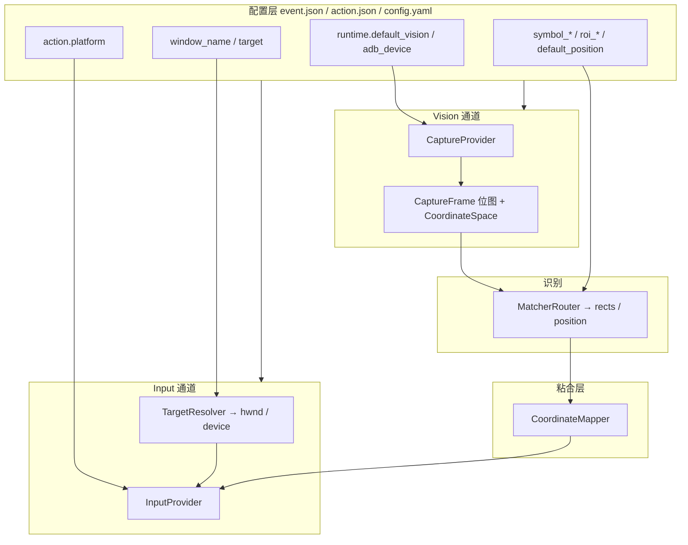
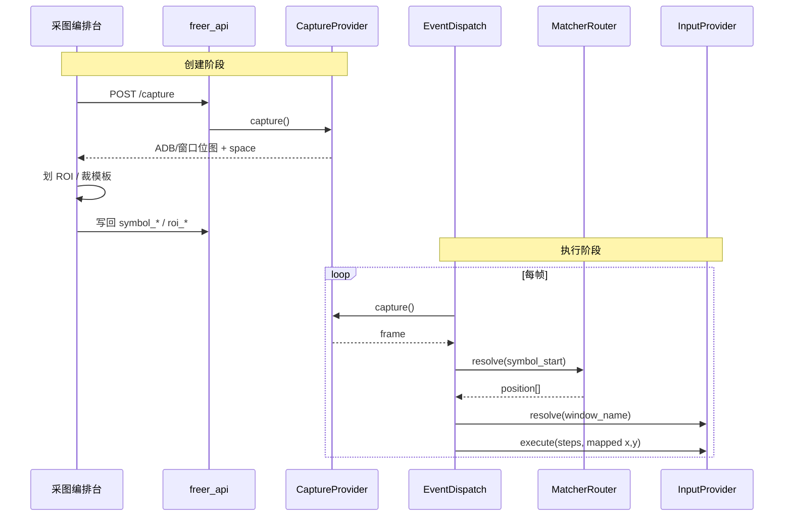

# Freer 升级计划 V3

> **定位**：在 [UPGRADE_PLAN_V2.md](./UPGRADE_PLAN_V2.md)（V0.4.3+ 执行排期）基础上，正式定义 **Vision / Input 双通道运行时架构**，为 Windows / macOS / ADB 可组合扩展留出实现空间。  
> **原则**：画面源与输入目标解耦；坐标空间可解释；用户选「工作模式」而非死记 `adb_device` + `window_name`；设备/窗口配置**按需引导**，非全局门槛。  
> **基线**：工作区 **V0.4.x**；V2 阶段 5A–5G / 5F 项目化进行中或已部分落地；当前引擎为 **「ADB 截屏 + Win32/ADB 点击」混合架构**（见 V2 §1.3.1）。

---

## 一、背景与动机

### 1.1 用户侧痛点

| 痛点 | 根因 |
|------|------|
| 很难开始第一步 | `adb_device` 藏在设置文本框；与「编事件」无关却像全局前置条件 |
| ROI / 模板不知相对谁 | 采图时未声明坐标空间；换模拟器/分辨率后静默失效 |
| Win32 与 ADB 混用不透明 | 识别坐标来自 ADB 画面，点击发到 `window_name` 子窗口；**无校准层、文档分散** |
| `capture_mode` 误导 | 配置存在，引擎仅 ADB；用户以为可 Win32 抓窗 |

### 1.2 产品方向（已确认）

1. **未来要在 Windows 或 macOS 上执行操作**——不限于 ADB。  
2. **存在纯 Windows、纯 ADB、混合三种合理场景**——设备不是永远必选。  
3. **创建事件 → ROI 划取 → 模板裁剪 → 任务执行** 全链路须能回答：**依赖什么运行时目标**。

### 1.3 对 V2 的修正

V2 §十三 明确「**不实现 Win32/GDI 窗口截图**」（5C-8 仅诚实化 ADB-only）。  
**V3 将 Win32/mac 窗口截图与纯桌面模式纳入排期**，作为 Phase 7 的可扩展实现，而非 V2 5C-8 的「不做」范围。

| V2 决策 | V3 调整 |
|---------|---------|
| 截屏仅 ADB，文档写清 | 保留为默认模式 `emulator_mixed`；新增 `desktop_window` 等模式 |
| `capture_mode` 隐藏或标 planned | 接入 `CaptureProvider` 注册表，按模式展示可用项 |
| Win32 截图「另独立 RFC，默认不排」 | **本文即 RFC**；排入 Phase 7B |
| 设备选择 UI 未设计 | Phase 7C：按 Vision 通道按需引导 |

---

## 二、术语与架构模型

### 2.1 核心结论（一句话）

Freer **不绑定进程 PID**，也**不把「事件」当作运行时句柄**。  
运行时绑定两类目标：

| 通道 | 职责 | 典型依赖 |
|------|------|----------|
| **Vision（视觉）** | 截屏、ROI、模板匹配、`symbol_*` 触发/完成 | ADB 设备 **或** 窗口位图 |
| **Input（输入）** | `click` / `drag` / `key` / `text` | Win32/mac 窗口 **或** ADB 设备 |

事件 JSON 是**配方**：把「在什么画面上找什么」与「往哪里点」写在一起；真正解析在运行时由 `RuntimeContext` 完成。

### 2.2 架构图



### 2.3 绑定对象对照

| 对象 | 是否使用 | 配置位置 | 运行时解析 |
|------|----------|----------|------------|
| **事件 name** | 逻辑标识 | `event.json` | 栈调度，非句柄 |
| **进程 PID** | **否** | — | 不作为主键（仅可调试附加） |
| **ADB 设备 serial** | Vision / adb Input | `config` → `runtime.adb_device` | `adb -s <serial>` |
| **窗口标题** | Win/mac Input；未来 Vision | `event.window_name` 或 `event.target` | `FindWindow` / `CGWindowList` |
| **坐标空间** | 隐式（今日缺失） | ROI 元数据（可选） | `CaptureFrame.space` |

### 2.4 全链路依赖（创建 → 执行）



| 阶段 | 依赖什么 | 不依赖什么 |
|------|----------|------------|
| ROI 划取、模板裁剪 | **Vision** 产出的位图像素坐标 | `window_name`、进程 |
| 子事件/微事件触发 | 当前 **Vision** 帧 + `symbol_*` | Input 目标 |
| 动作执行 | **Input** 目标 + 映射后的 `(x,y)` | 事件树结构本身 |
| 仅编事件/动作 | 无 | 设备、窗口 |

---

## 三、工作模式（用户套餐）

将底层通道组合包装为可选模式，避免暴露过多实现细节。

| 模式 ID | 显示名 | Vision | Input | 典型场景 | 必配项 |
|---------|--------|--------|-------|----------|--------|
| `configure_only` | 仅编配 | 无 | 无 | 只写 JSON、导入导出 | — |
| `emulator_mixed` | 模拟器混合 | `adb_pipe` | `windows` | 雷电/MuMu + Win32 点击 | `adb_device` + `window_name` |
| `emulator_pure_adb` | 纯 ADB | `adb_pipe` | `adb` | 真机/模拟器全 ADB | `adb_device` |
| `desktop_window` | 桌面窗口 | `win32_window` / `mac_window` | `windows` / `mac` | 原生 PC 应用 | `target`（窗口） |
| `desktop_window` (mac) | 桌面窗口 (macOS) | `mac_window` | `mac` | Mac 应用自动化 | 辅助功能 + 屏幕录制权限 |

**默认**：`emulator_mixed`（与今日行为一致）。

**模式与 UI**：

- 全局设置 / 首次引导选择模式。  
- 模式决定：采图编排台是否可用、启动任务前检查清单、动作默认 `platform`。  
- **`configure_only` 不阻断进入事件库**。

---

## 四、协议与接口设计（引擎内部）

### 4.1 `CoordinateSpace`

```python
@dataclass
class CoordinateSpace:
    id: str              # 例: "capture:adb:emulator-5554"
    origin: str          # "top_left"
    width: int
    height: int
    kind: str            # adb_device | win32_client | mac_window | screen
```

所有 `roi_*`、`default_position`、匹配结果矩形 **默认处于当前 Vision 帧的 `space`**。

可选持久化（用于分辨率变更告警）：

```json
"roi_meta": {
  "space_id": "capture:adb:emulator-5554",
  "frame_size": [1920, 1080]
}
```

### 4.2 `CaptureProvider`（Vision）

```python
class CaptureProvider(Protocol):
    def capture(self) -> CaptureFrame: ...
    def describe(self) -> CaptureProfile: ...
    def health(self) -> HealthStatus: ...
```

| Provider ID | 实现类 | 画面来源 | 坐标系 | 状态 |
|-------------|--------|----------|--------|------|
| `adb_pipe` | `AdbCaptureProvider` | `adb exec-out screencap -p` | 设备全屏像素 | **已有**（包装 `AdbClient`） |
| `win32_window` | `Win32WindowCaptureProvider` | `PrintWindow` / `BitBlt` 客户区 | 目标 hwnd 客户区 | Phase 7B |
| `mac_window` | `MacWindowCaptureProvider` | `CGWindowListCreateImage` | 窗口 bounds | Phase 7D |
| `desktop_region` | `ScreenRegionCaptureProvider` | mss / DXGI | 屏幕绝对坐标 | 远期 |

### 4.3 `InputProvider`（Input）

```python
class InputProvider(Protocol):
    def click(self, x, y, button): ...
    def pointer_down / up / move / drag(...): ...
    def key(self, code): ...
    def text(self, s): ...
```

| platform | 实现类 | 投递目标 | 坐标系 | 状态 |
|----------|--------|----------|--------|------|
| `windows` | `Win32InputProvider` | `PostMessage` → hwnd | hwnd **客户区** | **已有** |
| `adb` | `AdbInputProvider` | `adb shell input` | 设备全屏像素 | **已有** |
| `mac` | `MacInputProvider` | `CGEvent` | 窗口相对或屏幕绝对（须统一） | Phase 7D |

### 4.4 `TargetDescriptor` / `TargetResolver`

统一窗口与设备描述，兼容遗留 `window_name`：

```json
{
  "kind": "win32_window",
  "parent_title": "雷电模拟器",
  "child_title": "TheRender"
}
```

遗留映射：`"雷电模拟器|TheRender"` → 上表。

| kind | 解析方式 |
|------|----------|
| `adb_device` | `config.runtime.adb_device` |
| `win32_window` | `FindWindow` + `EnumChildWindows` |
| `mac_window` | `bundle_id` + `window_index` 或标题 |

### 4.5 `CoordinateMapper`

| 策略 ID | 场景 | 规则 |
|---------|------|------|
| `identity` | Vision 与 Input 同空间 | 直通（纯 ADB 或 纯 Win32 抓窗+点击） |
| `assumed_1to1` | ADB 画面 + Win32 子窗口点击 | **今日默认**；校验告警 + 文档 |
| `affine` | 缩放/偏移 | 用户校准或 `scale`/`offset` 配置 |
| `manual_offset` | 模拟器边框 | `offset_x/y` |

映射失败 → `TaskPausedError`，**禁止静默点偏**。

### 4.6 `RuntimeContext`

任务与 API 共享的运行时容器，替代散落的 `AdbClient()` 单例：

```python
@dataclass
class RuntimeContext:
    work_mode: str
    vision: CaptureProvider
    mapper: CoordinateMapper
    adb_device: str | None
    default_input_platform: str

    def resolve_input_target(self, event) -> ResolvedTarget: ...
    def input_for(self, platform: str) -> InputProvider: ...
```

- 任务 **running / paused** 时禁止更换 `RuntimeContext`（对齐 V2 切项目约束）。  
- `EventEx.__init__` 注入 `RuntimeContext`，不再内部 `AdbClient()` 写死。

---

## 五、配置模型

### 5.1 全局 `config.yaml`（演进）

```yaml
runtime:
  work_mode: emulator_mixed    # configure_only | emulator_mixed | emulator_pure_adb | desktop_window
  default_vision: adb_pipe     # CaptureProvider id
  default_input_platform: windows
  adb_device: emulator-5554
  coordinate_policy: assumed_1to1   # identity | assumed_1to1 | affine | manual_offset
  # affine:
  #   scale: [1.0, 1.0]
  #   offset: [0, 0]

# 遗留字段（迁移期双写，读取优先 runtime.*）
adb_device: emulator-5554
capture_mode: adb_pipe
active_project: default
```

**迁移**：`load_config` 将顶层 `adb_device` / `capture_mode` 并入 `runtime`；保存时双写一轮，V0.6 再去顶层。

### 5.2 事件级 `event.json`（向后兼容扩展）

保留：`window_name`、`symbol_*`、`roi_*`、`default_position`、`match_type_*`。

可选新增（不破坏旧客户端）：

```json
{
  "name": "点击开始",
  "window_name": "雷电模拟器|TheRender",
  "target": {
    "input": {
      "kind": "win32_window",
      "parent_title": "雷电模拟器",
      "child_title": "TheRender"
    }
  },
  "vision_override": null,
  "symbol_start": "img/btn_start.bmp",
  "roi_start": [100, 200, 400, 500]
}
```

- `vision_override: null` → 使用全局 `default_vision`。  
- 未提供 `target` → 从 `window_name` 解析。

### 5.3 动作级 `action.json`

`platform` = 选择 `InputProvider`，与 Vision 无关。

**联合校验扩展**（`validate.py`）：

| work_mode / vision / platform | 规则 |
|-------------------------------|------|
| `emulator_mixed` | 缺 `window_name` + windows 指针步骤 → `issues` |
| `emulator_pure_adb` | 有 `window_name` → `warnings`（通常多余） |
| `desktop_window` | vision=input 窗口一致 → 推荐 `identity` mapper |
| `configure_only` | 跳过运行时 health |

---

## 六、执行主循环（目标形态）

```text
EventDispatch loop:
  1. frame = runtime.vision.capture()
     → 失败: TaskPausedError(vision_unavailable)

  2. self.frame = frame
  3. 调度：GetPosition(symbol_*) 基于 frame.image + frame.space

  4. GetInputTarget(event) → ResolvedTarget
     → 失败: TaskPausedError(target_not_found)

  5. 微事件 DoMicroEvent:
       position = symbol 或 default_position
       ActionEx.doAction(action, position, mapper, target, runtime)

  6. execute_step:
       pt = random_in_rect
       pt' = mapper.map(pt, frame.space → input.space)
       input_provider.execute(op, pt', target)
```

与今日差异：

| 今日 | V3 目标 |
|------|---------|
| 每帧 `FrameContext.capture(AdbClient())` | `runtime.vision.capture()` |
| `GetWindowHwnd()` 仅 window_name | `TargetResolver` + 缓存 |
| 无 mapper，隐式 1:1 | 显式 `coordinate_policy` |
| `MacAction.unsupported` | `MacInputProvider`（7D） |

---

## 七、平台实现要点

### 7.1 Windows

| 能力 | API 候选 | 用于 |
|------|----------|------|
| 找窗口 | `FindWindow` / `EnumChildWindows` / UI Automation（远期） | Input + Vision |
| 截窗 | `PrintWindow(hwnd)` / `BitBlt` 客户区 | `win32_window` Vision |
| 点击 | `PostMessage`（模拟器内嵌） | 已有 `WindowsAction` |
| 前台点击 | `SendInput` | 原生应用（可选） |
| 文字 | `WM_CHAR` / `SendInput` Unicode | **替代** windows `text` 走 ADB（V2-P2-6） |

**纯 Windows 模式**：Vision 与 Input 均在 hwnd 客户区 → `identity` mapper，**不依赖 ADB**。

### 7.2 macOS

| 能力 | API | 权限 |
|------|-----|------|
| 列窗 | `CGWindowListCopyWindowInfo` | — |
| 截窗 | `CGWindowListCreateImage` | 屏幕录制 |
| 输入 | `CGEventCreate` + `CGEventPost` | 辅助功能 |
| 文字 | `CGEventKeyboardSetUnicodeString` | 辅助功能 |

GUI：选 `mac` platform 前检测权限；未授权则引导系统设置。

### 7.3 ADB

| 能力 | 说明 |
|------|------|
| 设备列表 | `GET /devices`（Phase 7C） |
| 截屏 | 已有 `screencap` |
| 输入 | 已有 `input tap/swipe/text` |

**注意**：多开模拟器时 serial 可能变化；UI 提供扫描，**不自动切换**（防误绑）。

---

## 八、GUI 与产品交互

### 8.1 三层配置 UI

```text
┌─ 工作模式（设置 / 首次引导）──────────────┐
│  ○ 模拟器混合 (ADB 画面 + Win 点击) [默认] │
│  ○ 纯 ADB                                  │
│  ○ 桌面窗口 (Win / mac)                    │
│  ○ 仅编配（不连接画面源）                   │
└────────────────────────────────────────────┘

┌─ 画面源（按需展开）────────────────────────┐
│  adb:   [设备列表 ▼]  状态 ● 在线         │
│  或 窗口: [选择窗口…]                       │
└────────────────────────────────────────────┘

┌─ 操作目标（事件 / 动作）───────────────────┐
│  window_name / 选窗口 / platform 徽章     │
└────────────────────────────────────────────┘
```

**不做**：与 `ProjectSwitcher` 并列的常驻「设备大切换器」（V2 审查已否决）。

### 8.2 按需引导（非全局门槛）

| 页面 / 操作 | `configure_only` | 需要 Vision 的模式 |
|-------------|------------------|------------------|
| 事件库编辑 | 直接可用 | 直接可用 |
| 采图编排台 / 模板实验室 | 禁用 + 提示切模式 | Vision health 失败 → banner |
| 识别 preview | 同上 | 同上 |
| 启动任务 | 可提示模式不匹配 | 启动前检查清单 |

### 8.3 任务启动前检查清单

| 检查项 | mixed | pure adb | desktop |
|--------|-------|----------|---------|
| Vision 在线 | ADB 设备 `device` | ADB | 窗口存在 |
| Input 目标 | `window_name` 可解析 | — | 窗口可解析 |
| 坐标策略 | `assumed_1to1` 或已校准 | `identity` | `identity` |
| 动作 platform | windows/adb 兼容 | adb | windows/mac |

### 8.4 与 V2 Phase 5G 的关系

[采图编排台](./gui/src/components/capture/CaptureWorkbench.tsx) 已嵌入事件编辑；V3 要求：

- 打开编排台时绑定 **当前 `CaptureProvider`**。  
- 文案写明坐标空间（今日已有「ADB 截屏像素」一句，扩展为 `space` 展示）。  
- 裁剪写回时可选附带 `roi_meta`。

---

## 九、API 变更

### 9.1 新增（Phase 7）

| 方法 | 路径 | 说明 |
|------|------|------|
| GET | `/runtime/health` | `work_mode`、`vision`、`input` 分项 health |
| GET | `/devices` | ADB 设备列表（仅 `adb_pipe` vision 时有意义） |
| GET | `/windows` | 可选窗口列表（Win/mac，需平台支持） |
| PUT | `/runtime/mode` | 切换 `work_mode` + 关联配置；任务运行中 409 |

### 9.2 演进

| 现有 | 调整 |
|------|------|
| `GET /config` | 增加 `runtime` 块 |
| `PUT /config` | 接受 `runtime.*`；任务运行中改 `adb_device` → 409 |
| `GET /health` | 可选摘要 `vision_ready: bool`（轻量，不做重扫描） |
| `POST /capture` | 走 `RuntimeContext.vision`，非写死 `AdbClient` |

### 9.3 OpenAPI / GUI types

- `gui/src/api/types.ts` 增加 `RuntimeHealth`、`WorkMode`、`AdbDevice`。  
- `capture_mode` 与 `runtime.default_vision` 对齐，废弃孤立枚举。

---

## 十、Phase 7 路线图

```text
V2 核心（5A–5G）继续推进
        │
        ▼
Phase 7A  抽象层（行为不变）
        │
        ├──► 7B  Win32 窗口 Vision
        │
        ├──► 7C  运行时健康 + ADB 设备 UX
        │
        ├──► 7D  macOS Input + Vision
        │
        └──► 7E  坐标校准 + 高级校验
```

### Phase 7A — 运行时抽象（V0.6.0）

**里程碑 M-7A**：引擎行为与今日一致，但内部走 `RuntimeContext`。

| 任务 | 关键文件 | 说明 |
|------|----------|------|
| **7A-1 CaptureProvider 协议** | `recognition/capture/` | `AdbCaptureProvider` 包装现有逻辑 |
| **7A-2 InputProvider 协议** | `recognition/input/` 或 `Tools.py` 拆分 | 包装 `WindowsAction` / `AdbAction` |
| **7A-3 RuntimeContext** | `Control.py`, `freer_api/task_runner.py` | 注入 `EventEx`；任务中禁止重建 |
| **7A-4 CoordinateSpace + assumed_1to1** | `recognition/coordinates.py` | 显式 policy；默认直通混合模式 |
| **7A-5 config.runtime 块** | `config.py`, `models.py` | 双写迁移 |
| **7A-6 validate 扩展** | `validate.py` | mixed 模式契约告警 |

**验收**：

- [ ] `pytest` 全绿；任务行为与 7A 前一致  
- [ ] `capture_mode` 读 `runtime.default_vision`  
- [ ] 日志可打印当前 `space.id`

### Phase 7B — Win32 窗口 Vision（V0.6.1）

**里程碑 M-7B**：`desktop_window` 模式在 Windows 上可采图、可跑任务，**零 ADB**。

| 任务 | 说明 |
|------|------|
| **7B-1 Win32WindowCaptureProvider** | `PrintWindow` / `BitBlt`；客户区坐标 |
| **7B-2 TargetResolver 统一** | `window_name` → `TargetDescriptor` |
| **7B-3 work_mode=desktop_window** | GUI 模式选项 + 窗口选择器 |
| **7B-4 identity mapper** | vision=input 同 hwnd 时自动 `identity` |
| **7B-5 Windows text 改 Win32** | 闭合 V2-P2-6（可选与本阶段并行） |

**验收**：

- [ ] 无 ADB 环境下：选窗口 → 采图 → 划 ROI → 跑纯 windows 动作  
- [ ] 坐标与点击一致（同 hwnd 客户区）

### Phase 7C — 运行时健康与设备 UX（V0.6.2）

**里程碑 M-7C**：需要 Vision 时才引导配置；编配无感。

| 任务 | 说明 |
|------|------|
| **7C-1 GET /runtime/health** | vision/input 分项 |
| **7C-2 GET /devices** | `adb devices -l` 解析 |
| **7C-3 设置页画面源区块** | 扫描 / 选择 / 手动 serial |
| **7C-4 模板页 & 任务页 banner** | Vision 离线时展示 |
| **7C-5 顶栏轻量状态** | 状态点 + 点击展开（非 ProjectSwitcher 级） |
| **7C-6 任务运行中禁止改设备** | API 409 |

**验收**：

- [ ] `configure_only` 无设备 banner  
- [ ] 采图前设备离线可一步选择  
- [ ] 单在线设备仅「建议切换」，不自动写配置

### Phase 7D — macOS（V0.6.3）

| 任务 | 说明 |
|------|------|
| **7D-1 MacInputProvider** | CGEvent；替换 `MacAction.unsupported` |
| **7D-2 MacWindowCaptureProvider** | 需权限检测 |
| **7D-3 GUI 权限引导** | 辅助功能 + 屏幕录制 |
| **7D-4 GUI 启用 mac platform** | 取消「仅 schema」状态 |

### Phase 7E — 坐标校准与增强（V0.6.x）

| 任务 | 说明 |
|------|------|
| **7E-1 affine 校准向导** | 三点或两点对齐 ADB 画面与 hwnd |
| **7E-2 roi_meta 分辨率告警** | 与当前 frame 尺寸比对 |
| **7E-3 UI Automation 找窗** | 降低标题重复风险 |
| **7E-4 per-event vision_override** | 单事件指定窗口截图 |

---

## 十一、测试策略

| 阶段 | 新增测试 |
|------|----------|
| **7A** | `AdbCaptureProvider`；`assumed_1to1` mapper；`RuntimeContext` 注入 mock |
| **7B** | `Win32WindowCaptureProvider` mock hwnd；identity 端到端（可选集成） |
| **7C** | `/devices` 解析单测；`/runtime/health` 契约 |
| **7D** | mac provider 单元测试（CI 可 skip 无 mac runner） |
| **7E** | affine 变换单测；`roi_meta` validate warning |

**原则**：7A 不得降低 V2 §十二 对 5A P0 路径的覆盖。

---

## 十二、风险与依赖

| 风险 | 缓解 |
|------|------|
| Win32 截窗黑屏/透明窗 | 文档列已知限制；fallback `BitBlt`；远期 DXGI |
| mixed 模式 1:1 假设不成立 | 7E 校准；默认 validate warning |
| mac 权限用户困惑 | 分步引导 + 检测 API |
| 配置迁移破坏旧包 | `runtime` 双写一轮；导入导出兼容 |
| 与 V2 PR 冲突 | **7A 在 5C-8 诚实化之后**；7B 可与 5G 并行 |

---

## 十三、明确不做（V3 范围内）

- 不以 **进程 PID** 作为窗口/设备主键  
- 不做「启动必先选设备」全局 Gate（`SidecarGate` 仍只验 API）  
- 不在 7A 完成前实现 Win32 截窗（先抽象、后实现）  
- 不优先 `desktop_region` 全屏抓屏（无窗口绑定的野坐标）  
- 不替代 V2 的 5A P0 修复优先级——**引擎可信仍先于 7B**

---

## 十四、版本目标（V3）

| 版本 | 主题 | 关键交付 | 依赖 |
|------|------|----------|------|
| **V0.5.0** | 项目化 | V2 **5F** | — |
| **V0.5.1** | 采图编排 | V2 **5G** | 5C-8 |
| **V0.6.0** | 运行时抽象 | **7A** Capture/Input/RuntimeContext | 5A–5C 核心 |
| **V0.6.1** | 桌面窗口 (Win) | **7B** Win32 Vision + `desktop_window` | 7A |
| **V0.6.2** | 连接体验 | **7C** health + 设备按需引导 | 7A |
| **V0.6.3** | macOS | **7D** | 7A |
| **V0.6.x** | 校准增强 | **7E** | 7B/7C |
| **V1.0** | 正式版 | V2 5A–5E + 7A–7C 验收 | — |

---

## 十五、与既有文档关系

| 文档 | 用途 |
|------|------|
| [UPGRADE_PLAN.md](./UPGRADE_PLAN.md) | Phase 0–3.5 历史架构、Matcher/GUI 细节 |
| [UPGRADE_PLAN_V2.md](./UPGRADE_PLAN_V2.md) | **执行排期**：5A–5G、问题编号、PR 切分 |
| **UPGRADE_PLAN_V3.md**（本文） | **运行时双通道架构 RFC** + Phase 7 排期；修正 V2 对 Win32 截图的「不做」 |

### V2 条款承接表

| V2 章节 | V3 承接 |
|---------|---------|
| §1.3.1 截屏仅 ADB | §二–§三：默认 mixed；7B 扩展 |
| §5C-8 截屏诚实化 | 7A 接入；7C UX |
| §5G 采图编排台 | §8.4 绑定 CaptureProvider |
| §十三 Win32 截图不做 | **由 V3 Phase 7B 承接** |
| §十一 Phase 6+ mac | **由 V3 Phase 7D 承接** |

---

*维护：2026-06 架构讨论（Vision/Input 双通道、工作模式、按需设备引导）。下一步：完成 V2 5A–5C 核心后启动 **7A 运行时抽象**。*
